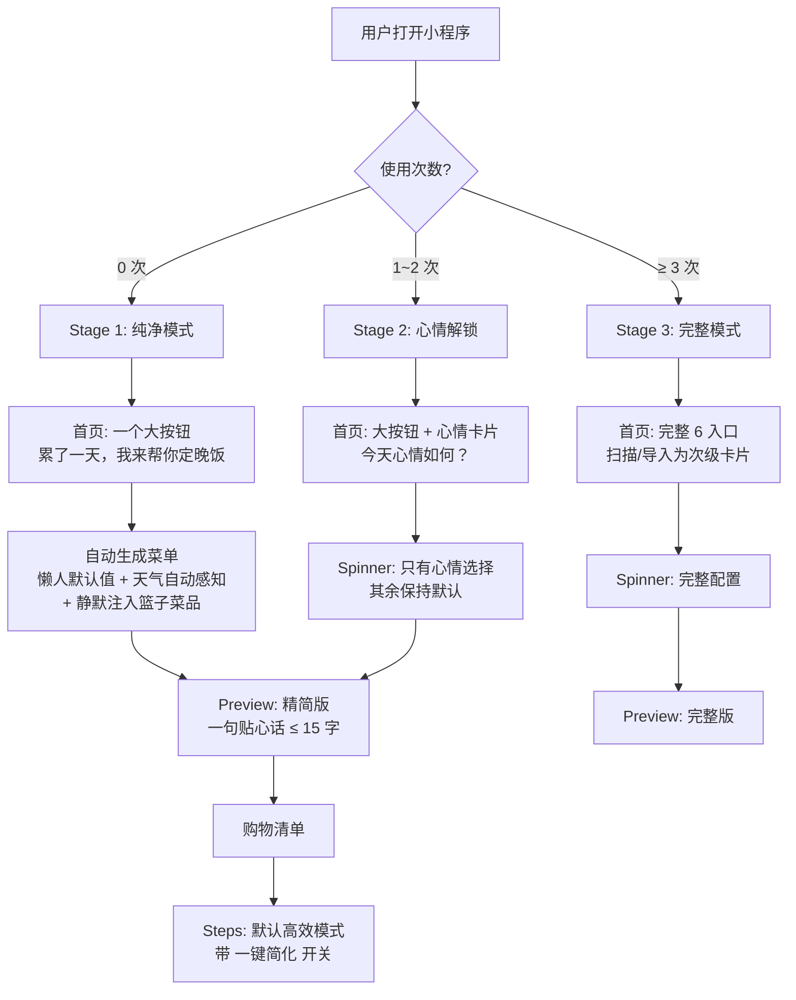

# Zen Mode 极简新手模式改造计划

## 核心理念变更（对比 v1 方案）

v1 方案（纯 GPT 极简）存在 3 个问题，本方案全部修正：


| 维度   | v1 方案                    | v2 方案（本方案）                    | 理由                   |
| ---- | ------------------------ | ----------------------------- | -------------------- |
| 入口决策 | 强制问"谁做饭"(self/caregiver) | 不问，默认高效模式，Steps 页提供"一键简化"开关   | 真实场景是"协同指挥"，不是二选一    |
| 灵感篮子 | 完全屏蔽                     | 保留为"静默插件"：空=隐形，有内容=惊喜注入       | 篮子是"对生活向往"的情感出口      |
| 解锁节奏 | Day-1 → 立刻全开             | 3 阶段渐进（Day 1 / Day 2 / Day 7） | 功能应该"生长出来"而非"一次性倒出来" |


---

## 架构总览




---

## 阶段 1: Zen Mode 检测与状态管理

**文件**: `[miniprogram/app.js](miniprogram/app.js)`

### 检测逻辑

利用已有的 `menu_history` Storage（格式: `{ "2026-02-03": [...], "2026-02-04": [...] }`），统计有多少个不同日期有记录：

```javascript
// app.js globalData 新增
zenMode: {
  usageCount: 0,    // 不同日期有烹饪记录的天数
  stage: 1           // 1 | 2 | 3
}
```

计算规则（纯同步，`onLaunch` 中执行）：

```javascript
function getZenStage() {
  try {
    var raw = wx.getStorageSync('menu_history');
    var history = raw ? (typeof raw === 'string' ? JSON.parse(raw) : raw) : {};
    var count = Object.keys(history).length;
    if (count === 0) return { usageCount: 0, stage: 1 };
    if (count < 3)   return { usageCount: count, stage: 2 };
    return { usageCount: count, stage: 3 };
  } catch (e) {
    return { usageCount: 0, stage: 1 };
  }
}
```

**Stage 含义**:

- **Stage 1** (usage = 0): 纯净模式 — 一个按钮，零配置
- **Stage 2** (usage 1~2): 心情解锁 — 引入心情选择
- **Stage 3** (usage >= 3): 完整模式 — 全部功能可见

### 新增 Storage Key


| Key              | 类型     | 说明                          |
| ---------------- | ------ | --------------------------- |
| `zen_mode_stage` | Number | 缓存当前阶段，避免每次解析 history（可选优化） |


---

## 阶段 2: 算法层 — Zen Mode 菜单约束

**文件**: `[miniprogram/data/menuGenerator.js](miniprogram/data/menuGenerator.js)`

> 遵循 R-14：本阶段只改算法层，不碰任何 UI 文件。独立提交。

新增纯函数 `applyZenConstraints(recipes, options)`：

```javascript
/**
 * Zen Mode 菜单约束过滤（纯函数，R-01 合规）
 * @param {Array} recipes - 候选菜谱数组
 * @param {Object} options
 * @param {boolean} options.isTired - 用户是否疲惫
 * @param {number}  options.maxDishes - 最大菜品数（tired=2, ok=3）
 * @returns {Array} 过滤后的候选菜谱
 */
function applyZenConstraints(recipes, options) { ... }
```

过滤规则（层层递进）：

- 排除 `flavor_profile === 'spicy'`（新手避免翻车）
- 排除 `prep_time > 15`（不要复杂刀工）
- `isTired` 时额外排除 `cook_minutes > 20`
- `isTired` 时额外排除 `cook_type === 'stew'`（长耗时）
- 优先 `tags` 包含 `'quick'` 或 `'home'` 的菜品
- 结果截取 `maxDishes` 道

**同时新增** `getZenDefaultPreference()` 纯函数：

```javascript
function getZenDefaultPreference(isTired) {
  return {
    adultCount: 2,
    hasBaby: false,
    meatCount: 1,
    vegCount: 1,
    soupCount: 0,
    avoidList: [],
    dietStyle: 'home',
    isTimeSave: isTired
  };
}
```

**不碰**: `generateMenuWithFilters`、`filterByPreference`、`computeDashboard` 等现有函数。

---

## 阶段 3: UI 层 — 首页 Zen Mode

**文件**: `[home.wxml](miniprogram/pages/home/home.wxml)`, `[home.js](miniprogram/pages/home/home.js)`, `[home.wxss](miniprogram/pages/home/home.wxss)`

### Stage 1 (usage = 0): 纯净首页

只显示：

- 品牌 header（保留）
- 氛围卡片（天气**自动感知** — 调用现有 `locationWeather.getWeather()`，不让用户手动输入）
- **一个大按钮**: "累了一天，我来帮你定晚饭"
- 隐藏: 拍照清冰箱、导入菜谱、混合组餐、我的菜谱库、灵感篮子角标/预览条、历史推荐卡片

实现: `home.wxml` 中用 `wx:if="{{zenStage >= 2}}"` 控制次级入口的显示，`wx:if="{{zenStage >= 3}}"` 控制高级入口。

### Stage 2 (usage 1~2): 心情引入

- 大按钮保留，但下方出现心情选择卡片（4 个: 开心/疲惫/馋了/随便）
- 扫描/导入仍然隐藏
- 灵感篮子角标如果有内容可以显示（静默插件）

### Stage 3 (usage >= 3): 完整首页

恢复全部 6 入口，但**视觉层级调整**：

- "今天吃什么" 仍为最大入口
- 扫描/导入/混合组餐/我的菜谱库 缩小为次级卡片（已有 CSS class，只是 Stage 1/2 隐藏）

### 天气自动感知

已有 `[locationWeather.js](miniprogram/pages/home/locationWeather.js)` 完全满足需求。`home.js` 中 `onLoad` 或 `onShow` 调用 `locationWeather.getWeather()` 把天气写入 `vibeWeather`，spinner 直接从 `weatherForApi` 读取。**用户无需任何操作**。

---

## 阶段 4: UI 层 — Spinner 页渐进式配置

**文件**: `[spinner.wxml](miniprogram/pages/spinner/spinner.wxml)`, `[spinner.js](miniprogram/pages/spinner/spinner.js)`, `[spinner.wxss](miniprogram/pages/spinner/spinner.wxss)`

### Stage 1: 直接生成（跳过 Spinner 或极简 Spinner）

两种实现路径供选择:

**方案 A: 直接跳过 Spinner**

- `home.js` 中的大按钮点击后，不跳转 Spinner，而是直接在 `home.js` 中调用 `menuData.getTodayMenusByCombo(zenDefaultPref)` + 天气自动注入，生成后直接跳 Preview
- 优点：零决策，最简路径
- 缺点：需要在 home.js 中复制一部分生成逻辑

**方案 B: 进入 Spinner 但自动触发（推荐）**

- 进入 Spinner 时检测 `zenStage === 1`
- 自动填充默认偏好 + 天气
- 显示一个极简过渡页（"正在为你安排晚餐..."），1~2 秒后自动触发 `onStartGenerate()`
- 优点：复用现有生成流程，改动最小
- 缺点：多一个页面跳转

### Stage 2: 只显示心情

```
context-bar              → 保留（自动天气）
mood-section             → 保留（4 个心情卡片）
priority-section         → 隐藏
history-quick-bar        → 隐藏
pref-section-wrap        → 隐藏（折叠偏好全部隐藏）
cta-wrap                 → 保留（选完心情后显示"开始"按钮）
spinner-container        → 隐藏转盘动画（直接跳 Preview）
```

心情到 mood 枚举的映射复用现有逻辑。选完心情 + 点"开始"后，其余偏好走默认值。

### Stage 3: 完整 Spinner

恢复所有配置项，与当前一致。

---

## 阶段 5: UI 层 — Steps 页"一键简化"开关

**文件**: `[steps.wxml](miniprogram/pages/steps/steps.wxml)`, `[steps.js](miniprogram/pages/steps/steps.js)`, `[steps.wxss](miniprogram/pages/steps/steps.wxss)`

> **核心设计变更**: 不在入口问"谁做饭"，而是在 Steps 页提供动态切换。默认高效模式，用户觉得复杂则一键切换为线性简化视图。

### 新增"一键简化"开关

位置: Steps 页头部（`cook-header` 区域内），或底部操作栏右侧

```
[ ☰ 简化模式 ]  ←  toggle 按钮
```

行为:

- 默认 OFF — 高效并行模式（现有逻辑）
- 点击 ON — 触发线性简化:
  1. 调用 `menuData.generateSteps(preference, { forceLinear: true })`（复用已有 `triggerFallback` 的核心逻辑）
  2. 隐藏并行状态条 (`parallel-float-bar`)
  3. 隐藏阶段标签 (`phase-chip`)
  4. 隐藏甘特图入口
  5. 步骤卡片文案简化（但不重构为 caregiver 格式，保持统一渲染）
  6. 底部按钮文案改为 "做好了，下一步"
- 可以来回切换（toggle ON → OFF 重新生成并行步骤）

### 实现要点

`steps.js` 中已有完整的 `triggerFallback` 机制（约第 1260~1307 行），核心逻辑为：

```javascript
newSteps = menuData.generateSteps(preference, { forceLinear: true });
that._stepsRaw = newSteps;
that._currentStepIndex = 0;
that._updateView(newSteps);
```

新增 `onToggleSimplifyMode()` 方法，复用此逻辑，但：

- 不弹 Modal 确认（一键切换，无需确认）
- 切回高效模式时调用 `menuData.generateSteps(preference)` （无 forceLinear）
- 用 `this.data.isSimplifyMode` 控制 WXML 中的条件渲染

### WXML 增量改动

```xml
<!-- cook-header 区域新增 -->
<view class="simplify-toggle" bindtap="onToggleSimplifyMode">
  <text class="simplify-toggle-text">{{isSimplifyMode ? '恢复高效' : '简化模式'}}</text>
</view>

<!-- 条件隐藏并行相关元素 -->
<view wx:if="{{!isSimplifyMode && activeParallelTasks.length > 0}}" class="parallel-float-bar">
  ...
</view>

<!-- 条件隐藏阶段标签 -->
<text wx:if="{{!isSimplifyMode && currentPhaseLabel}}" class="phase-chip ...">...</text>

<!-- 条件隐藏时长（简化模式下可选隐藏） -->
<view wx:if="{{!isSimplifyMode && currentStep.duration}}" class="focus-duration">...</view>
```

### Zen Mode 下的默认值

- `zenStage === 1`: `isSimplifyMode` 默认 `true`（新手默认简化）
- `zenStage >= 2`: `isSimplifyMode` 默认 `false`（有经验后默认高效）

---

## 阶段 6: UI 层 — Preview 页 Zen Mode 精简

**文件**: `[preview.wxml](miniprogram/pages/preview/preview.wxml)`, `[preview.js](miniprogram/pages/preview/preview.js)`

### Zen Mode (Stage 1~2) 下的简化

- **隐藏 dashboard-bar**: 预估时间、火力、食材分类 — 对新手是噪音
- **隐藏 preview-hints**: 营养提示、备菜顺序建议等
- **AI 理由**: `chefReportText` 截取为 ≤ 15 字的贴心短句
  - 若 AI 返回了 reasoning，取前 15 字 + "。"
  - 若为空，使用预设: "为你搭配好了，放心做吧"
  - 若有篮子菜品被选中: "把你想吃的 {菜名} 也排进去了"
- **隐藏"换一换"和"换掉未勾选"按钮**: Stage 1 下不暴露换菜选项，只保留"开始做饭"
- **保留菜品卡片**: 用户需要知道做什么，但不需要操控

```xml
<!-- preview-actions 区域 -->
<view class="preview-actions">
  <button wx:if="{{zenStage >= 3}}" class="..." catchtap="handleShuffle">换一换</button>
  <button wx:if="{{zenStage >= 3}}" class="..." catchtap="handleReplaceUnchecked">换掉未勾选</button>
  <button class="preview-btn preview-btn-primary" catchtap="confirmAndGo">开始做饭</button>
</view>
```

---

## 阶段 7: 灵感篮子静默化

**文件**: `[home.wxml](miniprogram/pages/home/home.wxml)`, `[spinner.js](miniprogram/pages/spinner/spinner.js)`

### 核心原则: 空=隐形, 有内容=惊喜注入

**首页**:

- `zenStage === 1`: 隐藏 `.basket-bar` 和 `.basket-badge`（即使有内容也不显示入口）
- `zenStage >= 2`: 篮子非空时显示角标（现有逻辑）
- **但**: 无论 zenStage 是几，如果篮子有内容，生成菜单时都会将其传给 `smartMenuGen` 云函数

**Spinner**:

- `zenStage <= 2`: 隐藏 `priority-section`（优先策略开关）
- 但 `onStartGenerate()` 中的篮子注入逻辑保持不变 — 篮子内容会被静默地纳入 AI 推荐

**Preview**:

- 若菜单中包含了篮子菜品（`fromBasket === true`），显示一句惊喜文案:
  - "把你昨天想吃的 {菜名} 也排进去了 🧺"
  - 这在 Zen Mode 下是唯一暴露篮子存在感的地方

**效果**: 用户第一次不需要知道灵感篮子是什么。但如果他们在小红书看到菜谱、通过分享链接导入后，下一次生成会自动把那道菜排进去——"哇，它竟然知道我想吃这个"。

---

## 阶段 8: 容错与兜底

### Zen Mode 专属兜底规则

- AI 超时/失败 → 静默调用 `_applyLocalMenus()`，应用 `applyZenConstraints`
- Steps 生成失败 → 使用 `forceLinear: true` 再试一次，仍失败则显示极简兜底步骤
- **不弹任何 "生成失败" 弹窗** — 用 `console.warn` 记录，用户看到的永远是一个正常的菜单
- 天气获取失败 → 静默忽略（已有逻辑），使用默认问候语

### 兜底菜单策略

Zen Mode Stage 1 下，如果本地菜谱池过滤后候选 < 2 道:

- 放宽 `prep_time` 限制到 20 分钟
- 放宽 `cook_minutes` 限制到 30 分钟
- 仍然保持 `flavor_profile !== 'spicy'` 约束

---

## 阶段 9: spec.md 新增 Section 11

**文件**: `[docs/spec.md](docs/spec.md)`

新增内容:

### Section 11: 极简新手模式 (Zen Mode)

**R-17 (Zen Mode Rules)**:
当用户使用次数 < 3 或状态标记为 tired 时:

1. 自动折叠首页所有配置项，仅保留"一键生成"大按钮
2. 强制将 PHASE_2 和 PHASE_3 的并行度降低 50%（通过 `applyZenConstraints` 约束菜品数量间接实现）
3. 结果页展示理由仅限 15 字以内
4. Steps 页默认进入简化模式（`isSimplifyMode: true`）
5. 灵感篮子为静默插件模式（隐藏入口但保留后台注入）

**渐进式解锁阶梯**:


| Stage | 触发条件       | 首页       | Spinner     | Preview     | Steps    |
| ----- | ---------- | -------- | ----------- | ----------- | -------- |
| 1     | usage = 0  | 一个按钮     | 跳过/自动生成     | 精简版，仅"开始做饭" | 默认简化模式   |
| 2     | usage 1~2  | 大按钮 + 心情 | 心情选择 + 默认偏好 | 精简版，仅"开始做饭" | 默认高效，可切换 |
| 3     | usage >= 3 | 完整 6 入口  | 完整配置        | 完整版         | 默认高效，可切换 |


---

## 文件变更矩阵


| 文件                 | 变更类型                                                      | 影响范围   | 阶段  |
| ------------------ | --------------------------------------------------------- | ------ | --- |
| `app.js`           | 增量: `getZenStage()` + `globalData.zenMode`                | 全局     | 1   |
| `menuGenerator.js` | 增量: `applyZenConstraints` + `getZenDefaultPreference` 纯函数 | 算法层    | 2   |
| `home.wxml`        | 增量: `wx:if="{{zenStage >= N}}"` 条件渲染                      | 首页 UI  | 3   |
| `home.js`          | 增量: 读取 zenStage，天气自动感知注入                                  | 首页逻辑   | 3   |
| `home.wxss`        | 增量: Zen CTA 大按钮样式                                         | 首页样式   | 3   |
| `spinner.wxml`     | 增量: Stage 条件渲染隐藏配置区                                       | 配置页 UI | 4   |
| `spinner.js`       | 增量: Stage 1 自动生成逻辑，Stage 2 心情模式                           | 配置页逻辑  | 4   |
| `preview.wxml`     | 增量: Zen Mode 隐藏 dashboard/hints/换菜按钮                      | 预览页 UI | 6   |
| `preview.js`       | 增量: AI 理由截取 ≤ 15 字                                        | 预览页逻辑  | 6   |
| `steps.wxml`       | 增量: 简化模式 toggle + 条件隐藏并行元素                                | 步骤页 UI | 5   |
| `steps.js`         | 增量: `onToggleSimplifyMode()` + 默认简化控制                     | 步骤页逻辑  | 5   |
| `steps.wxss`       | 增量: toggle 按钮样式                                           | 步骤页样式  | 5   |
| `docs/spec.md`     | 增量: Section 11 + R-17                                     | 文档     | 9   |


> 所有变更均为增量修改，严格遵循 R-12 (不整体重写 WXML/WXSS)、R-13 (WXML ↔ WXSS 一致性)、R-14 (UI/算法变更隔离)。

