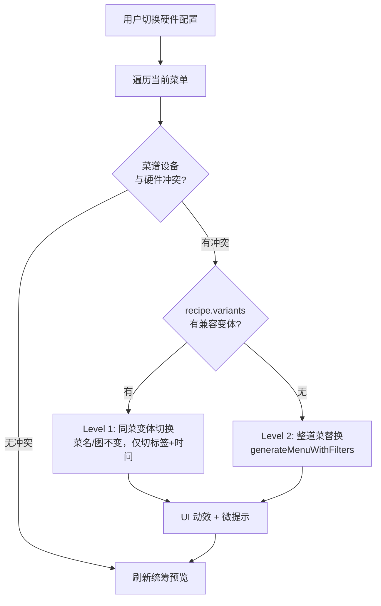

# 一菜多变体 + 硬件静默降级

## 架构总览




## Phase 1: 数据模型 — `variants` 字段

### 1.1 recipes.js 元信息层（本地精简）

在现有菜谱对象上新增可选字段 `variants`。无 variants 的菜谱完全向后兼容，走 Level 2 兜底。

```js
// 以红烧肉为例 (id: "a-pork-7")
{
  "id": "a-pork-7",
  "name": "红烧肉",
  "meat": "pork",
  "cook_type": "stew",         // 默认变体的 cook_type
  "cook_minutes": 60,
  // ... 现有字段不变 ...
  "variants": [
    {
      "vid": "default",
      "cook_type": "stew",
      "device": "stove_long",
      "cook_minutes": 60,
      "label": "传统炖锅版"
    },
    {
      "vid": "rice_cooker",
      "cook_type": "rice_cooker",
      "device": "rice_cooker",
      "cook_minutes": 70,
      "label": "电饭煲版",
      "tags": ["hands_free"]
    },
    {
      "vid": "microwave",
      "cook_type": "microwave",
      "device": "microwave",
      "cook_minutes": 25,
      "label": "极速微波炉版",
      "tags": ["fast", "office"]
    }
  ]
}
```

**设计原则**：

- `vid` 极简（不带 recipe ID 前缀），完整 key = `recipeId + ":" + vid`
- 顶层 `cook_type` / `cook_minutes` 始终反映**当前激活变体**的值（变体切换时同步更新）
- `device` 字段对应 `[menuGenerator.js](miniprogram/data/menuGenerator.js)` 中 `COOK_TYPE_TO_DEVICE` 的值域（`wok`/`stove_long`/`steamer`/`oven`/`air_fryer`/`rice_cooker`/`microwave`/`none`）
- 无 `variants` 字段的菜谱 = 单变体，等价于 `[{ vid: "default", device: getRecipeDevice(recipe) }]`

### 1.2 云端存储层

云数据库 `recipes` 集合中，variant 专属的 `steps` 和 `ingredients` 按子文档或独立集合存储：

```
// 方案 A: 子文档（推荐，减少查询次数）
{
  _id: "a-pork-7",
  name: "红烧肉",
  // ... 现有字段 ...
  variants: [
    { vid: "default", steps: [...], ingredients: [...] },
    { vid: "rice_cooker", steps: [...], ingredients: [...] },
    { vid: "microwave", steps: [...], ingredients: [...] }
  ]
}
```

### 1.3 兼容层 — cloudRecipeService.js

`[miniprogram/utils/cloudRecipeService.js](miniprogram/utils/cloudRecipeService.js)` 的 `normalizeCloudRecipe()` 需要新增对 `variants` 字段的透传：

```js
// basicFields 数组中追加 'variants'
var basicFields = [
  // ... 现有字段 ...
  'variants'
];
```

同时在读取完整菜谱时，若 `activeVariantId` 存在，从 `variants` 数组中提取对应的 `steps` / `ingredients` 覆盖顶层字段。

## Phase 2: menuGenerator.js — 导出设备工具 + 变体查找

### 2.1 导出已有内部函数

在 `[miniprogram/data/menuGenerator.js](miniprogram/data/menuGenerator.js)` 的 `module.exports` 中追加：

```js
getRecipeDevice: getRecipeDevice,
computeDeviceLimits: computeDeviceLimits,
getEffectiveCookType: getEffectiveCookType,
COOK_TYPE_TO_DEVICE: COOK_TYPE_TO_DEVICE,
```

### 2.2 新增 `findCompatibleVariant(recipe, kitchenConfig)`

```js
function findCompatibleVariant(recipe, kitchenConfig) {
  if (!recipe || !recipe.variants || !Array.isArray(recipe.variants)) return null;
  var limits = computeDeviceLimits(kitchenConfig);
  for (var i = 0; i < recipe.variants.length; i++) {
    var v = recipe.variants[i];
    var device = v.device || (COOK_TYPE_TO_DEVICE[v.cook_type] || 'wok');
    if (limits[device] == null || limits[device] > 0) return v;
  }
  return null;
}
```

## Phase 3: preview.js — 两级降级拦截器

### 3.1 `_checkAndReplaceDeviceConflicts()` 核心方法

在 `[miniprogram/pages/preview/preview.js](miniprogram/pages/preview/preview.js)` 中新增：

```
遍历 _fullPreviewMenus:
  → 对每个 menu.adultRecipe 调用 getRecipeDevice()
  → 如果 computeDeviceLimits(config)[device] === 0:

    Level 1: 变体切换
      → findCompatibleVariant(recipe, config)
      → 如果找到：overlay variant 的 cook_type/cook_minutes 到 recipe
      → row 标记 { isSwapped: true, swapLabel: variant.label }
      → 菜名/图片不变

    Level 2: 整道菜替换（兜底）
      → generateMenuWithFilters(meat, ..., { kitchenConfig })
      → 构建全新 row，标记 { isSwapped: true, swapLabel: null }
```

### 3.2 挂载到 `_refreshScheduleAfterKitchenChange()`

在 `[_refreshScheduleAfterKitchenChange()](miniprogram/pages/preview/preview.js)` 的**持久化之后、统筹刷新之前**插入调用：

```js
_refreshScheduleAfterKitchenChange: function () {
  // ... 持久化 kitchenConfig ...
  this._checkAndReplaceDeviceConflicts();  // 新增
  // ... 刷新统筹预览 ...
}
```

## Phase 4: UI 层 — WXML + WXSS

### 4.1 WXML (`[preview.wxml](miniprogram/pages/preview/preview.wxml)`)

在 `dish-card-wrap` 上添加条件类和标签提示：

```xml
<view class="dish-card-wrap {{item.isSwapped ? 'is-swapped' : ''}}" ...>
  <!-- 变体标签（Level 1 切换时显示） -->
  <view class="variant-swap-tag" wx:if="{{item.swapLabel}}">
    <text class="variant-swap-text">切换至{{item.swapLabel}}</text>
  </view>
  <!-- 整道菜替换提示（Level 2） -->
  <view class="swap-hint" wx:if="{{item.isSwapped && !item.swapLabel}}">
    <text class="swap-hint-text">已根据当前硬件重新适配</text>
  </view>
  <!-- 现有卡片内容不变 -->
</view>
```

### 4.2 WXSS (`[preview.wxss](miniprogram/pages/preview/preview.wxss)`)

- `swapGlow` 动画：卡片边缘绿色光晕闪烁
- `variant-swap-tag`：卡片右上角滑入的小标签（如 `[ 切换至电饭煲版 ]`）
- `swap-hint`：底部淡入的微提示文字
- 500ms 后自动清除 `isSwapped` 标志

## Phase 5: 种子数据 — 5-10 道高频菜谱手动补 variant

在 `[recipes.js](miniprogram/data/recipes.js)` 中为以下菜谱手动添加 `variants` 数组：


| 菜谱      | ID       | 默认             | 变体候选                   |
| ------- | -------- | -------------- | ---------------------- |
| 红烧肉     | a-pork-7 | stew (灶台炖)     | rice_cooker, microwave |
| 可乐鸡翅    | m003     | stew (灶台炖)     | air_fryer, rice_cooker |
| 番茄牛腩    | a-beef-2 | stew (灶台炖)     | rice_cooker            |
| 咖喱牛腩    | a-beef-5 | stew (灶台炖)     | rice_cooker, microwave |
| 白切鸡     | a-chi-4  | steam (蒸)      | microwave              |
| 蒜蓉西兰花   | a-veg-2  | stir_fry (灶台炒) | microwave              |
| 清蒸鳕鱼    | a-fish-1 | steam (蒸)      | microwave              |
| 土豆炖牛肉   | m009     | stew (灶台炖)     | rice_cooker            |
| 栗子焖鸡    | a-chi-3  | stew (灶台炖)     | rice_cooker            |
| 白菜豆腐炖五花 | a-pork-4 | stew (灶台炖)     | rice_cooker            |


**注意**：variant 的 steps/ingredients 暂不录入 recipes.js（精简原则），后续通过爬虫或手动录入云端。本地元信息仅含 `vid`/`cook_type`/`device`/`cook_minutes`/`label`。