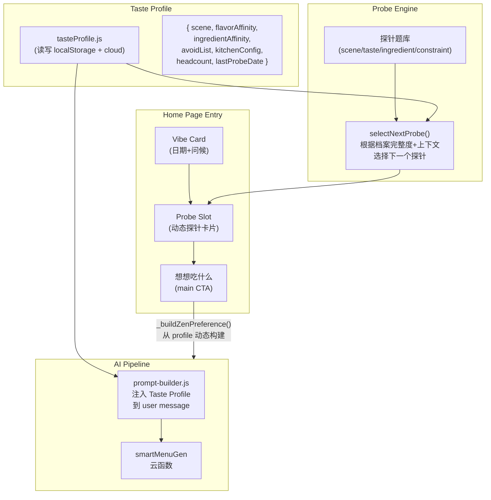

# 需求探针（Demand Probes）系统设计方案

## 核心理念

当前 Zen Mode 的"想想吃什么"按钮背后，偏好几乎全是硬编码（2人/1荤1素/家常）。AI 管道（smartMenuGen）虽已支持 mood/weather/preference，但客户端喂给它的 preference 信息量极低。需求探针的目标是：**用最少的交互摩擦，把 preference 的信息密度拉满**。

设计原则：

- **不是问卷，是对话** — 每次只问一个问题，像朋友随口一问
- **即问即用** — 每个回答立刻影响下一次推荐，用户能感知"它真的在听"
- **渐进收敛** — 首次多问几个（3个），之后每次只补问 0-1 个，档案越满问越少
- **可遗忘** — 场景偏好随时可变（今天聚餐明天独食），持久偏好（不吃辣）才沉淀
- **刚需前置** — "冰箱里有必须用掉的食材"比"今天几个人"更急迫，库存焦虑是新用户 Aha Moment 的最短路径

战略定位：

- **推荐得准 = 获客钩子** — 探针让 AI 推荐从盲选进化到懂你，驱动口碑传播
- **口味档案 = 数据壁垒（Data Moat）** — 用户使用越久，迁移成本越高，留存率自然攀升
- **kitchenConfig = 商业化预埋** — 厨房设备数据是未来增值服务的基础；V1.2 可推"主厨订阅版"解锁空气炸锅+烤箱+双灶台四线极限并行算法，基础版仅双灶台并行。Phase 1 先静默收集设备数据，为 IRR 打基础

## 架构总览




## 一、探针类型设计（4 个维度）

### 1. 场景探针（Scene Probe）— "今晚什么局？"

出现时机：每次进入首页（场景是易变的）
交互形式：横向 2-4 个 status-card（复用现有 `.status-card` 样式）


| 选项   | 内部值         | 对 preference 的影响                              |
| ---- | ----------- | --------------------------------------------- |
| 就我   | `solo`      | adultCount=1, meatCount=1, vegCount=0-1       |
| 两个人  | `couple`    | adultCount=2, 保持默认                            |
| 一家人  | `family`    | adultCount=3-4, hasBaby 可追问                   |
| 来客人了 | `gathering` | adultCount=4-6, soupCount=1, dietStyle='rich' |


视觉：类似现有的"今天状态"卡片区域，用图标+极简文字，一排平铺。

### 2. 口味探针（Taste Probe）— "今天嘴馋什么味？"

出现时机：场景确定后，或档案中 flavorAffinity 为空时
交互形式：横向 capsule 药丸（复用 `.capsule-item`）

选项示例（每次展示 3-4 个，轮换）：

- 清淡点 → flavorAffinity.light += 1
- 来点辣的 → flavorAffinity.spicy += 1
- 酸酸的 → flavorAffinity.sour_fresh += 1
- 随便吧 → 不更新，跳过

视觉：药丸式横向排列，选中后微微放大+品牌色描边，0.3s 后自动收起。

### 3. 库存探针（Inventory Probe）— "有必须用掉的食材吗？"  [Phase 1 提权]

**战略价值：** "处理掉不想浪费的剩菜"是比"今天几个人吃"更急迫的刚需。当 AI 能完美解决用户的"库存焦虑"时，新用户的 Aha Moment 会来得更早，口碑裂变更快。

出现时机：Phase 1 即纳入探针引擎轮换池，在场景探针之后偶尔穿插（约每 3 次出现 1 次）
交互形式：横向 capsule 药丸，极简分类

选项：

- 肉类要用掉 → 标记 `urgentIngredient: 'meat'`，AI 优先选含肉菜品
- 蔬菜要用掉 → 标记 `urgentIngredient: 'vegetable'`，AI 优先选素菜消耗方案
- 海鲜要用掉 → 标记 `urgentIngredient: 'seafood'`
- 没有 → 跳过

影响链路：`urgentIngredient` 作为高优先级约束注入 AI prompt（类似现有灵感篮子的 high priority 逻辑），覆盖食材偏好排序。

### 4. 食材探针（Ingredient Probe）— "今天想吃点什么？"

出现时机：口味确定后，或档案中 ingredientAffinity 为空时
交互形式：3-4 个圆角 tag（复用 `.pref-tag`）

选项示例（根据季节+历史动态生成）：

- 海鲜 → ingredientAffinity.seafood += 1, 影响 meat 字段候选池
- 牛羊肉 → ingredientAffinity.beef += 1
- 鸡鸭 → ingredientAffinity.chicken += 1
- 都行 → 不限制

### 5. 约束探针（Constraint Probe）— "有啥不能吃的？"

出现时机：仅首次使用或主动编辑时
交互形式：多选 tag（复用 `.pref-tag.is-selected`）
选项：不吃辣 / 海鲜过敏 / 花生过敏 / 乳糖不耐 / 麸质过敏 / 都能吃
持久化：写入 avoidList，长期生效

## 二、探针引擎（Probe Engine）

新增文件 `miniprogram/logic/probeEngine.js`：

```javascript
// 核心逻辑伪码
function selectNextProbe(profile, context) {
  // context = { isFirstVisit, daysSinceLastProbe, hour, weekday, visitCount }
  
  // 首次进入：依次问 scene → constraint → inventory（3 步，刚需优先）
  if (isFirstVisit) return FIRST_VISIT_SEQUENCE[step]
  
  // 日常进入：场景必问（天天变），库存探针按节奏穿插
  if (!profile.scene) return 'scene'
  
  // 库存探针：每 3 次访问穿插 1 次（解决"冰箱焦虑"刚需）
  if (context.visitCount % 3 === 1) return 'inventory'
  
  // 档案补全：缺口味时补问，缺食材时补问
  if (!profile.flavorAffinity || isEmpty(profile.flavorAffinity)) return 'taste'
  if (!profile.ingredientAffinity || isEmpty(profile.ingredientAffinity)) return 'ingredient'
  
  // 档案完整 → 不问了，直接展示 vibe greeting
  return null
}
```

**关键规则：**

- 每次最多展示 1 个探针（不是列表，是单卡片）
- 点击"想想吃什么"时，如果有未回答的探针，**不阻塞**，使用默认值
- 探针选择结果缓存在 `wx.setStorageSync('taste_profile', ...)`
- 场景探针每次都问（volatile），口味/食材探针有答案后不再重复问（persistent）

## 三、Taste Profile 数据结构

新增文件 `miniprogram/data/tasteProfile.js`：

```javascript
{
  // 场景（volatile，每次更新）
  scene: 'couple',          // solo | couple | family | gathering
  headcount: 2,             // 从 scene 推导
  
  // 口味亲和度（persistent，累加衰减）
  flavorAffinity: {
    light: 3,               // 选过 3 次"清淡"
    spicy: 7,               // 选过 7 次"来点辣的"
    sour_fresh: 1,
    salty_umami: 2,
    sweet_sour: 0
  },
  
  // 食材亲和度（persistent，累加衰减）
  ingredientAffinity: {
    seafood: 2,
    beef: 5,
    chicken: 3,
    pork: 1,
    vegetable: 4
  },
  
  // 硬约束（persistent）
  avoidList: ['spicy', 'peanut'],
  
  // 库存急用（volatile，单次有效，用完即清）
  urgentIngredient: null,   // 'meat' | 'vegetable' | 'seafood' | null
  
  // 厨房配置（persistent，独立设置页）
  // 战略预埋：V1.2 可基于设备数据推"主厨订阅版"（解锁多设备极限并行）
  kitchenConfig: {
    burners: 2,
    hasSteamer: false,
    hasAirFryer: true,
    hasOven: false
  },
  
  // 元数据
  createdAt: '2026-02-24',
  lastProbeAt: '2026-02-24',
  totalCooks: 12,
  visitCount: 0,            // 累计访问次数（驱动库存探针轮换节奏）
  version: 1
}
```

Storage key: `taste_profile`（与现有 `today_menus_preference` 共存，后者记录本次会话偏好，前者记录长期画像）

## 四、UI 集成方案

### Home 页改造

在 [home.wxml](miniprogram/pages/home/home.wxml) 中，在 vibe-card 和 zen-main-btn 之间插入 Probe Slot：

```
vibe-card (日期+问候)
    ↓
probe-card (动态探针，0-1 个)    ← 新增
    ↓
zen-main-btn (想想吃什么)
    ↓
zen-status-cards (今天状态: 还行/疲惫)
```

**probe-card 的交互动效（Wabi-sabi 呼吸感）：**

- **出现**：probe-card 从下方浮现，`transition: all 0.4s ease-out`（比一般动效慢 0.1s，制造"缓缓浮上来"的纸质感），延迟 0.4s 跟在 vibe-card 后面，像一张信纸被风轻轻掀开
- **选中**：用户点击选项时，触发 `wx.vibrateShort({ type: 'light' })` 轻触觉反馈，选中项微微放大（scale 1.05）+ 品牌色描边，给予"按实了"的确认感
- **收起**：0.5s 后 card 整体向上收缩（`max-height → 0, opacity → 0, margin → 0`，`transition: all 0.35s ease-in`），比出现快一拍，干脆利落不拖沓
- **即时确认**：收起后在"想想吃什么"按钮上方浮现一行极淡文字（`opacity: 0.45, font-size: 24rpx`），例如："已记下：今晚两个人，吃清淡点。" 或 "好的，先消灭冰箱里的肉。" — 这种即时反馈建立极强的产品信任感，让用户确信"它真的在听"
- **文字衰退**：确认文字停留 3s 后 fade-out（`transition: opacity 1s ease`），不干扰主 CTA

### `_buildZenPreference()` 改造

在 [home.js](miniprogram/pages/home/home.js) 的 `_buildZenPreference()` 中，从 tasteProfile 动态读取：

```javascript
_buildZenPreference: function () {
  var profile = tasteProfile.get();
  var isTired = this.data.cookStatus === 'tired';
  var scene = profile.scene || 'couple';
  
  // 从 scene 推导人数和菜品结构
  var sceneConfig = SCENE_CONFIGS[scene];
  
  // 从 flavorAffinity 推导 dietStyle
  var dietStyle = tasteProfile.inferDietStyle(profile.flavorAffinity);
  
  // 从 ingredientAffinity 推导推荐主料
  var preferredMeats = tasteProfile.inferPreferredMeats(profile.ingredientAffinity);
  
  return {
    adultCount: sceneConfig.adultCount,
    hasBaby: sceneConfig.hasBaby || false,
    meatCount: sceneConfig.meatCount,
    vegCount: sceneConfig.vegCount,
    soupCount: sceneConfig.soupCount,
    avoidList: profile.avoidList || [],
    dietStyle: dietStyle,
    isTimeSave: isTired,
    kitchenConfig: profile.kitchenConfig || { burners: 2 },
    // 新增：传递给 AI 的扩展字段
    preferredMeats: preferredMeats,
    flavorHint: tasteProfile.getFlavorHint(profile.flavorAffinity),
    // 库存急用：单次消费，用完即清（Aha Moment 加速器）
    urgentIngredient: profile.urgentIngredient || null
  };
  // 用完后清除 urgentIngredient，避免下次复用
  if (profile.urgentIngredient) tasteProfile.clearUrgent();
}
```

### AI Prompt 增强

在 [prompt-builder.js](cloudfunctions/smartMenuGen/lib/prompt-builder.js) 的 `buildUserMessage()` 中新增 Section：

```
## 用户口味档案
- 偏好口味：辣味(7次) > 素食(4次) > 清淡(3次)
- 偏好食材：牛羊(5次) > 鸡鸭(3次) > 海鲜(2次)
- 根据口味档案，请在满足套餐结构的前提下，适当偏向用户喜好的口味和食材

## 库存急用（如有）
- ⚡ 用户冰箱有【肉类】需要尽快消耗，请优先选择含肉菜品
- 这是用户的明确意图，优先级高于口味偏好（类似灵感篮子的 high priority 逻辑）
```

这让 AI 从"盲选"变为"懂你的选"。库存急用的注入逻辑复用现有灵感篮子（basketItems）的 high priority 范式，确保 AI 能正确理解优先级。

## 五、实施路线

### Phase 1（MVP + 库存刚需，约 3 天）

- 新建 `tasteProfile.js`（读写 + 推导逻辑 + urgentIngredient 单次消费机制）
- 新建 `probeEngine.js`（探针选择引擎：场景探针 + 库存探针轮换 + 约束探针首次触发）
- Home 页嵌入 probe-card UI（Wabi-sabi 呼吸感动效 + haptic feedback + 即时确认文字）
- `_buildZenPreference()` 从 profile 动态构建，urgentIngredient 注入 preference
- 本地推荐即可感知差异（场景 → 人数/菜品结构变化，库存 → 食材优先级变化）

### Phase 2（AI 增强 + 口味探针，约 2 天）

- `prompt-builder.js` 注入 Taste Profile（口味/食材亲和度 + urgentIngredient 高优约束）
- 新增口味探针 + 食材偏好探针
- 探针引擎的渐进收敛逻辑（档案越满问越少）
- kitchenConfig 探针（静默收集设备数据，为 V1.2 商业化预埋）

### Phase 3（闭环反馈 + 数据壁垒，约 2 天）

- 做完饭后的隐式反馈（"这桌菜怎么样"→ 更新 affinity）
- 衰减算法（旧偏好权重逐渐降低，保持档案鲜活）
- 烟火集中展示个人口味画像（可视化数据壁垒，提升用户感知迁移成本）

## 六、关键文件清单


| 操作  | 文件                                                  | 说明                              |
| --- | --------------------------------------------------- | ------------------------------- |
| 新建  | `miniprogram/data/tasteProfile.js`                  | 口味档案数据层                         |
| 新建  | `miniprogram/logic/probeEngine.js`                  | 探针选择引擎                          |
| 修改  | `miniprogram/pages/home/home.wxml`                  | 插入 probe-card slot              |
| 修改  | `miniprogram/pages/home/home.wxss`                  | probe-card 样式（复用现有设计体系）         |
| 修改  | `miniprogram/pages/home/home.js`                    | 探针交互 + `_buildZenPreference` 改造 |
| 修改  | `cloudfunctions/smartMenuGen/lib/prompt-builder.js` | 注入 Taste Profile 到 AI prompt    |
| 修改  | `miniprogram/logic/DATA_PROTOCOL.md`                | 补充 tasteProfile 数据协议            |


