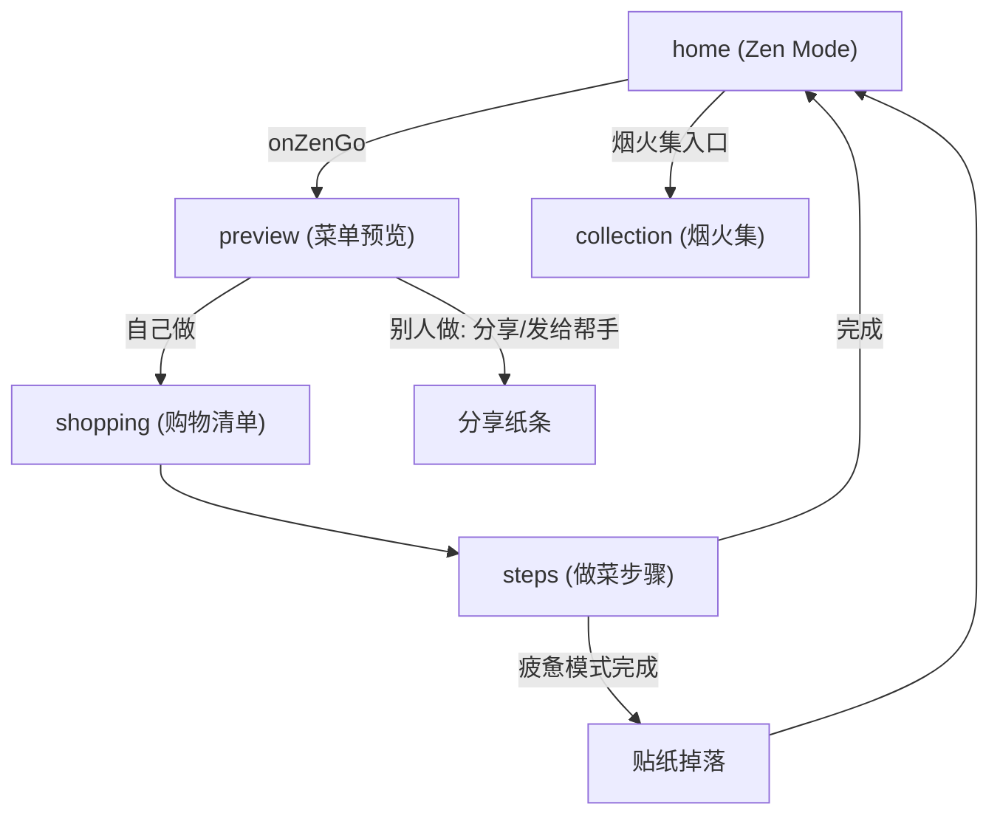

# TableSync 技术规格与 2026 需求实现状态

本文档为 TableSync 微信小程序的核心技术规格与 2026 版需求落地状态说明。需求原文见 [TableSync-核心逻辑与用户体验优化需求-2026.md](./TableSync-核心逻辑与用户体验优化需求-2026.md)。

---

## 1. 核心设计哲学

- **去 AI 感 (Invisible AI)**：不强调 AI 标签，强调「顺手」和「懂我」的直觉体感。
- **界面消失 (Interface ZERO)**：根据用户意图（心情、执行者）直接切换结果形态，消除冗余操作层级。
- **情绪共护**：根据用户疲惫程度提供治愈方案（如空气炸锅极简方案、纸条化交付）。

---

## 2. Zen Mode 状态机矩阵 (Logic Matrix)

算法与前端共同实现：`stressWeight` 通过 `preference.isTimeSave` 表达，`executorRole` 通过 `preference.who`（`caregiver` / `ayi`）表达。

| 维度 | 自己做 (Self) | 别人做 (Others) |
|------|---------------|-----------------|
| **心情还好 (Good)** | 追求成就感：保留精细化步骤，效率提升。**已实现**：常规菜单与步骤。 | 协作模式：清晰烹饪备忘录。**已实现**：preview 展示「给 Ta 的菜单」+ helper-card 纸条。 |
| **我很疲惫 (Tired)** | 极致减负：强制 `is_airfryer_alt`，优先空气炸锅/烤箱。**已实现**：menuGenerator 优先空气炸锅菜谱 + recipes 中 9 道 air_fryer 菜。 | 托付模式：「给 Ta 的小纸条」、操作难度极简。**已实现**：helper-card + formatForHelper 线性化步骤。 |

---

## 3. 页面导航与数据流

### 3.1 页面导航图

### 3.2 状态贯通机制

- **首页（无感角色切换）**：home 仅保留 **cookStatus**（还行 / 疲惫）选择；角色固定为「自己做」（cookWho 恒为 `self`，不再展示「谁来做」开关）。持久化：`wx.setStorageSync('zen_cook_status')`；`_buildZenPreference()` 产出 `preference.isTimeSave`、`preference.kitchenConfig.hasAirFryer`，`preference.who` 不传。
- **分享裂变**：用户点击分享时，`onShareAppMessage` 的 path 强制带 `role=helper`，接收方打开即进入 steps 执行者模式（纸条/阿姨模式），本机 preview 始终为标准视图。
- **preference** 通过 `getApp().globalData.preference` 与 storage 传递到 **preview → shopping → steps**。
- 各页根据 `preference.isTimeSave` 做差异化展示（空气炸锅标签、疲惫氛围等）；steps 根据 URL 参数 `role=helper` 进入执行者模式。

---

## 4. 需求模块实现状态

| 模块 | 状态 | 说明 |
|------|------|------|
| 视觉氛围 (Atmosphere) | 已完成 | home 全屏背景按 mood/executor 切换，0.8s 淡入淡出；preview/shopping 氛围与指标文案差异化。 |
| 空气炸锅强制 (is_airfryer_alt) | 已完成 | menuGenerator 疲惫模式优先空气炸锅池；recipes 新增 9 道 `cook_type: 'air_fryer'` 且 `is_airfryer_alt: true`。 |
| 纸条化交付 (Helper Memo) | 已完成 | components/helper-card 三大区（帮我准备 / 极简动作 / 情绪话术）；menuGenerator.formatForHelper(menus, preference, shoppingList)；preview 在 isHelperMode 下展示 helper-card。 |
| 全链路状态贯通 | 已完成 | preview/shopping/steps 读取 preference 与 Storage，展示 isHelperMode / isTiredMode 差异；steps 在 preference.who === 'caregiver' 时自动 isAyiMode。 |
| 烟火集与贴纸 | 已完成 | stickerCollection.js 数据层（9 种贴纸定义 + checkAllDropsOnComplete 批量检测 + 烹饪历史追踪）；sticker-drop 落叶飘落动画组件（队列 + 自动消失）；collection 页支持 emoji、可重复贴纸计数。详见 §10。 |
| preview 菜单区去重 | 已完成 | 今日菜单标题区仅保留主标题（今日菜单 / 给 Ta 的菜单），移除副标题 `previewMenuSubtitle` 与节奏芯片 `previewRhythmRings`，菜名仅在下方案品卡片展示，避免重复。 |
| 卖点后置与体验升级 | 已完成 | 首页移除「效率提升 +42%」/「空气炸锅模式」文案，改用天气感知问候；preview 页在菜品列表后展示串行 vs 并行统筹对比与烹饪顺序时间线；统筹逻辑抽至 utils/scheduleEngine.js；疲惫模式统筹区文案与色调差异化。详见 §5。 |
| 导入页入口与 UI | 已完成 | 导入页新增「加入混搭组餐」「随机配一桌」；英雄卡片、卡片化 section、AI 辅助信息合并、5 按钮布局。详见 §5.6。 |
| 今日菜单存储与导入菜兼容 | 已完成 | canSafelySlimMenus；含无 id 或 ext- 菜谱时存完整格式，避免 preview/steps 反序列化丢失（未知菜谱/步骤配料缺失）。详见 §5.7。 |
| stressWeight 评分因子 | 待扩展 | 当前 isTimeSave 已驱动过滤与空气炸锅优先，未单独暴露 stressWeight 数值。 |

---

## 5. 卖点后置与体验升级（2026）

> **目标**：将「效率提升」卖点从首页后置到用户已看到菜品内容的预览页，以串行 vs 并行对比与时间线呈现；首页用环境感问候替代数字指标；疲惫模式在统筹区做文案与视觉差异化。

### 5.1 首页降噪

- **移除**：home 页 Zen 面板下原「效率提升 +42%」（心情还好）与「空气炸锅模式 · 极致减负」（疲惫）文案。
- **实现**：删除 `home.js` 中 `zenBgIndicator` 的 data 与 `_updateZenBackground` 内所有 setData；删除 `home.wxml` 中 `zen-indicator` 节点；删除 `home.wxss` 中 `.zen-indicator` 相关样式。
- **填补**：首页 vibe 卡片沿用「今日日期 + 问候语」。问候语接入 `utils/vibeGreeting.js` 与 `utils/locationWeather.js`：`onLoad` 中异步调用 `locationWeather.getWeather()`，用 `vibeGreeting.pickGreeting(weather)` 更新 `vibeGreeting`，并将天气摘要写入 `vibeWeather`（如「12°C 小雨」）；无天气时 `pickGreeting(null)` 仍返回时段问候，体验不退化。

### 5.2 统筹预览公共模块

- **utils/scheduleEngine.js**：从 mix 页抽出的纯函数模块。
  - **computeSchedulePreview(selectedRecipes)**：输入菜谱数组（含 `prep_time`、`cook_minutes`、`cook_type`、`name`），返回 `totalTime`、`serialTime`、`savedTime`、`efficiency`、`cookingOrder`、`tips`、`devices`、`stoveCount` 等；炖煮/蒸制阶段带 `noWatch: true` 供预览页「无需看管」高亮。
  - **DEVICE_LABELS**：设备中文映射，供 mix 等使用。
- **mix.js**：改为 `require('../../utils/scheduleEngine.js')`，删除本地 `DEVICE_LABELS`、`COOK_TYPE_TO_DEVICE` 与 `computeSchedulePreview`，统一调用 `scheduleEngine.computeSchedulePreview(selectedRecipes)`。

### 5.3 预览页统筹对比区

- **展示时机**：仅在 `!isHelperMode && schedulePreview.savedTime > 0 && schedulePreview.efficiency > 10` 时展示，单道菜或两道全快炒（效率 &lt; 10%）不展示，符合「不炫技」克制原则。
- **数据**：`preview.js` 的 `_computePreviewDashboard(menus, pref)` 末尾根据当前菜单调用 `scheduleEngine.computeSchedulePreview(recipes)`，将结果挂在返回对象的 `schedulePreview` 上，并预计算 `parallelPercent = totalTime/serialTime*100` 供进度条宽度。所有会更新菜单的 setData（onLoad、handleShuffle、handleReplaceUnchecked、_recalcWithPreference、recommendExtra、_checkAndReplaceAvoidConflicts）均追加 `schedulePreview: dashboard.schedulePreview`，以整对象更新，避免全量 data 刷新。
- **视图**（preview.wxml，位于菜品列表与「再加个菜」之间）：
  - **串行 vs 并行对比**：上方灰色细条「常规烹饪 · XX 分钟」（删除线），下方彩色条「TableSync 统筹 · XX 分钟」，彩色条宽度为 `parallelPercent%`，带 `transition: width 0.8s ease` 换菜动画。
  - **效率印章**：正常模式显示「节省 XX 分钟」；疲惫模式显示「已开启极简统筹，减少 60% 手动操作」。
  - **烹饪顺序时间线**：与 mix 一致（先炖煮 → 同时蒸 → 最后快炒）；`noWatch` 阶段在疲惫模式下高亮。
- **样式**：preview.wxss 新增 `.schedule-compare-section`、对比条、`.efficiency-stamp`、`stampIn` 动画、时间线相关类（与 mix 对齐）。

### 5.4 疲惫模式差异化

- **统筹区**：`isTiredMode` 时背景暖黄、并行条渐变绿、时间与印章/提示文案为柔和绿；时间线中 `noWatch` 阶段（炖煮、蒸制）的 note 使用绿色高亮（`.timeline-item-no-watch .timeline-note`）。

### 5.5 涉及文件

| 文件 | 改动摘要 |
|------|----------|
| miniprogram/pages/home/home.js | 移除 zenBgIndicator；接入 vibeGreeting + locationWeather，onLoad 异步更新问候与天气。 |
| miniprogram/pages/home/home.wxml | 删除 zen-indicator 节点。 |
| miniprogram/pages/home/home.wxss | 删除 .zen-indicator 相关样式。 |
| miniprogram/utils/scheduleEngine.js | 新建；computeSchedulePreview、DEVICE_LABELS；炖/蒸阶段 noWatch。 |
| miniprogram/pages/mix/mix.js | 引用 scheduleEngine，删除重复常量与函数。 |
| miniprogram/pages/preview/preview.js | 引用 scheduleEngine；data.schedulePreview；_computePreviewDashboard 内计算并挂 schedulePreview；6 处 setData 追加 schedulePreview。 |
| miniprogram/pages/preview/preview.wxml | 统筹对比区（门控、双条、印章、疲惫文案、时间线）。 |
| miniprogram/pages/preview/preview.wxss | 对比区、印章、时间线、疲惫模式覆盖样式。 |

### 5.6 导入页入口与 UI 优化（2026）

- **新增按钮**：导入菜谱预览页在「直接开始做」下增加「加入混搭组餐」「随机配一桌」；原「保存到我的菜谱」「重新导入」改为与上排并排的两半宽按钮。
- **加入混搭组餐**：将当前导入菜谱写入 `globalData._pendingMixRecipe` 并跳转 mix 页；mix 的 onLoad 已支持自动把 `_pendingMixRecipe` 加入已选。
- **随机配一桌**：以导入菜为第一道，`getTodayMenusByCombo(pref)` 生成其余道（排除同名），写入 `today_menus`（见 §5.7）、`today_menus_preference`、`cart_ingredients` 与 `menuPreview`，再跳转 preview。
- **UI**：菜名+来源+标签合并为 `.preview-hero-card`；食材/步骤区加 `.result-card` 卡片样式；置信度与耗时合并为一行 `.ai-meta-row`；底部 5 按钮分主按钮 + 两行并排。
- **涉及文件**：import.js（onGoMix、onGoPreviewWithMenu）、import.wxml（英雄卡片、action-row、action-btn-half）、import.wxss（hero-card、result-card、ai-meta-row、action-row/half、mix/preview 按钮样式）。

### 5.7 今日菜单存储格式与导入菜兼容（2026）

- **问题**：`today_menus` 存为 slim（仅 adultRecipeId）时，反序列化依赖 `getAdultRecipeById`，仅能解析内置菜谱 id。导入菜无 id 或 id 为 `ext-*` 时反序列化得到 `adultRecipe: null`，preview 显示「未知菜谱」，步骤与配料也丢失。
- **约定**：仅当菜单中**每道菜**的 `adultRecipe` 均有「内置可解析 id」（有 id 且不以 `ext-` 开头）时，才将 `today_menus` 存为 slim；否则一律存**完整菜单**（含完整 adultRecipe 对象）。
- **menuData.canSafelySlimMenus(menus)**：新增函数，遍历 menus，若任一项无 `adultRecipe.id` 或 id 以 `ext-` 开头则返回 false，否则返回 true。供写入 storage 前判断。
- **调用点**：  
  - **import.js**（onGoPreviewWithMenu）：写 `today_menus` 前 `canSafelySlimMenus(menus)` 为 true 才 `serializeMenusForStorage`，否则 `JSON.stringify(menus)`。  
  - **preview.js**：① onLoad 首次写回；②「开始做饭」流程写 storage；③ onChangeAdultCount 持久化。三处均先 `canSafelySlimMenus(menus)`，为 true 才写 slim，否则写完整 menus。
- **涉及文件**：menuData.js（canSafelySlimMenus）、import.js、preview.js。

---

## 6. 组件清单

| 组件 | 路径 | 用途 |
|------|------|------|
| helper-card | components/helper-card/helper-card | 「别人做」模式下的纸条化菜单（The Prep / The Action / The Heart）。 |
| sticker-drop | components/sticker-drop/sticker-drop | 贴纸掉落弹层，从 steps 完成回首页时展示。 |

---

## 7. 关键数据与接口

- **formatForHelper(menus, preference, shoppingList)**  
  - 位置：`miniprogram/data/menuGenerator.js`  
  - 返回：`{ prepItems: [{ name, amountDisplay }], actions: [{ text }], heartMessage: string }`

- **stickerCollection.checkAllDropsOnComplete(ctx)**  
  - 位置：`miniprogram/data/stickerCollection.js`  
  - 参数：`{ isTired: boolean, isHesitant: boolean, recipeNames: string[] }`  
  - 返回：`[{ stickerId, name, emoji }]` 新掉落贴纸列表  
  - 内部依次检测：first_cook → tired_done → night_cook/morning_cook → hesitant_go → favorite_dish → lucky_cat

- **stickerCollection.tryDropSticker(stickerId, source)**  
  - 位置：`miniprogram/data/stickerCollection.js`  
  - 支持 repeatable 贴纸（如 lucky_cat，上限 5 次）

- **globalData.pendingStickerDrop**  
  - **数组格式**：`[{ stickerId, name, emoji }]`（兼容旧单对象格式）  
  - 步骤页完成时由 `checkAllDropsOnComplete` 写入；home 的 onShow 读取并传入 sticker-drop 组件队列展示。

- **globalData._hesitantStart**  
  - home 页 onZenGo 中检测到犹豫（停留 > 60s 或切换状态 >= 3 次）时设为 true；steps 完成时读取并传入贴纸检测。

- **scheduleEngine.computeSchedulePreview(recipes)**  
  - 位置：`miniprogram/utils/scheduleEngine.js`  
  - 输入：菜谱数组（含 prep_time、cook_minutes、cook_type、name）。  
  - 返回：totalTime、serialTime、savedTime、efficiency、cookingOrder、tips、devices、stoveCount 等；cookingOrder 中炖/蒸项带 noWatch: true。

- **menuData.canSafelySlimMenus(menus)**  
  - 位置：`miniprogram/data/menuData.js`  
  - 用途：写 `today_menus` 前判断是否可安全存为 slim。任一道菜 `adultRecipe` 无 id 或 id 以 `ext-` 开头则返回 false，否则返回 true。为 false 时应存完整菜单，避免反序列化时导入菜丢失。

---

## 8. 参考文档

- 需求汇总：[TableSync-核心逻辑与用户体验优化需求-2026.md](./TableSync-核心逻辑与用户体验优化需求-2026.md)
- 厨房设备与空气炸锅逻辑：[design-kitchen-devices-adaptation.md](./design-kitchen-devices-adaptation.md)

---

## 9. 云端菜谱与步骤/购物清单修复（AI 必读）

> **用途**：后续在其他窗口或会话中修改相关逻辑时，请先阅读本节，避免破坏已修复行为或重复修改。  
> **问题背景**：用户希望从云端查看菜谱的食材与步骤；本地 `recipes.js` 为精简版（无 steps/ingredients），完整数据来自云数据库。若同步时机、分页或缓存策略不当，会出现「步骤/食材缺失」「重新加载无反应」等问题。

### 9.1 数据流与原则

- **步骤与食材来源**：优先从 `cloudRecipeService` 的内存/存储缓存读取；缓存来自 `syncFromCloud()` 拉取的云数据库 `recipes` 集合。本地 `recipes.js` 仅作无网络或云端无数据时的兜底（且无 steps/ingredients）。
- **关键原则**：凡使用「今日菜单」或「混合组餐」等菜单数据生成步骤或购物清单时，**必须按菜谱 id 从当前缓存重新解析**（`getAdultRecipeById` / `getBabyRecipeById`），不能直接使用页面或 globalData 里保存的旧菜谱引用（可能是同步前拿到的残缺对象）。

### 9.2 cloudRecipeService.js 修改要点

| 修改点 | 说明 |
|--------|------|
| 分页拉取 | 小程序端云数据库 `get()` 单次最多返回 **20 条**。使用 `pageSize = 20`，且**每次分页重新** `collection.where(...).skip(skip).limit(20).get()`，不可复用同一 query 对象。 |
| 先更新内存再写存储 | 同步成功后**先**赋值 `_memoryCache.adultRecipes` / `babyRecipes`，**再**调用 `saveToStorage()`。这样即使本地存储因体积超限（如 10MB）写入失败，本次会话仍能使用完整数据。 |
| 安全网条件 | 仅当 **合并后条数为 0**（`mergedAdult.length === 0`）时才用本地 `recipes.js` 做 fallback 合并。若云端有数据（如 20 条），不再按「少于本地 50%」触发安全网，避免用无 steps 的本地数据冲掉云端数据。 |
| 存储失败日志 | `saveToStorage` 内对写入失败做 try/catch，并 `console.warn`，便于排查超限等问题。 |

### 9.3 menuData.js 修改要点

- **generateSteps**：当存在 `todayMenus` 时，先用 `resolveMenu` 对每条菜单按 `adultRecipe.id` / `babyRecipe.id` 调用 `getAdultRecipeById` / `getBabyRecipeById`，得到带 steps/ingredients 的菜谱，再基于 `menusWithFreshRecipes` 调用 `generator.generateSteps` / `generateUnifiedSteps` 和 `generateShoppingListFromMenus`。这样无论菜单是何时生成的，步骤与购物清单都基于**当前缓存**。
- 若某 id 在缓存中找不到带 steps 的菜谱，会打 `console.warn('[menuData.generateSteps] 缓存条数=..., 未找到带步骤的菜谱 id=...')` 便于排查。

### 9.4 步骤页 steps.js / steps.wxml 修改要点

| 修改点 | 说明 |
|--------|------|
| 自动重试 | 当生成的步骤为「需联网获取」提示（一条步骤且 `_isOfflineHint === true` 或 title 为「提示」且 details 含「联网」）时，约 **800ms 后自动调用** `retryLoadStepsFromCloud()`，无需用户点击。 |
| 重新加载按钮 | 按钮使用 `type="plain"`、`catchtap="retryLoadStepsFromCloud"`，不限制 `_source`，任意入口均可触发。若接口返回「同步进行中」，则约 **2.5s 后再试一次**。 |
| retryLoadStepsFromCloud 按来源处理 | **menu**：清空 `app.globalData.todayMenus` 后调用 `menuData.generateSteps`（会从 storage 的 today_menus 重新解析）。**mix**：用 `_mixMenus`（或 globalData.mixMenus）逐条按 id 解析后 `generateUnifiedSteps` / `generateSteps`。**scan**：用 `_scanRecipeIds` 调用 `menuData.generateStepsFromRecipeIds` 再更新步骤与 `_scanMenus`。**ayi**：存 `_ayiAdultCount`，用 `_ayiRecipeIds` 调用 `generateStepsFromRecipeIds`，写回 `todayMenus` 后 `generateSteps(..., { forceLinear: true })`。**import** 仅同步并 toast「已同步，请返回重新进入」。 |
| 展示 | 步骤缺失时展示「重新加载步骤」按钮、加载中文案及同步错误 `stepsSyncError`；`_updateView` 中根据是否离线提示设置 `showOfflineHint`。 |

### 9.5 购物清单页 shopping.js 修改要点

| 修改点 | 说明 |
|--------|------|
| updateList 数据源顺序 | ① 优先用**今日菜单**：`app.globalData.todayMenus` 或从 storage 的 `today_menus` 经 `deserializeMenusFromStorage` 得到；对每条菜单按 id 解析后 `generateShoppingListFromMenus`。② 若无今日菜单或未得到清单，则用 **mix**：若存在 `app.globalData.mixMenus`，同样按 id 解析后 `generateShoppingListFromMenus`。③ 再否则用已有 `cart_ingredients` 或 `menuData.generateShoppingList(pref)`。 |
| 写回 | 由 ① 或 ② 得到非空清单时，写入 `wx.setStorageSync('cart_ingredients', ...)` 并 `app.globalData.mergedShoppingList = ...`。 |
| onShow | `onShow` 中先执行 `this.updateList()`，再按 storage 做 setData，保证从步骤页等返回时用最新缓存刷新清单（含今日菜单与 mix 两路）。 |

### 9.6 步骤页入口与 source

| 入口 | source | 跳转示例 | 重试时数据来源 |
|------|--------|----------|----------------|
| 今日菜单 / 购物清单 | （无） | `/pages/steps/steps` | todayMenus（清空后从 storage 再解析） |
| 混合组餐 | mix | `?source=mix&recipeNames=...` | globalData.mixMenus，按 id 解析 |
| 扫描/冰箱组餐 | scan | `?source=scan&recipeIds=...` | _scanRecipeIds → generateStepsFromRecipeIds |
| 阿姨/分享卡片 | ayi | `?source=ayi&recipeIds=...&adultCount=...` | _ayiRecipeIds + _ayiAdultCount → generateStepsFromRecipeIds + forceLinear |
| 导入菜谱 | import | `?source=import&recipeName=...` | 仅同步 + toast，不按 id 解析（数据来自用户导入） |

### 9.7 涉及文件一览

- `miniprogram/utils/cloudRecipeService.js`：拉取、合并、内存/存储顺序、安全网、saveToStorage 日志。
- `miniprogram/data/menuData.js`：generateSteps 内 todayMenus 的 resolveMenu + menusWithFreshRecipes。
- `miniprogram/pages/steps/steps.js`：onLoad 自动重试、retryLoadStepsFromCloud（menu/mix/scan/ayi）、_ayiAdultCount 存储。
- `miniprogram/pages/steps/steps.wxml`：showOfflineHint、重新加载按钮、stepsReloading、stepsSyncError。
- `miniprogram/pages/steps/steps.wxss`：offline-reload 区域样式。
- `miniprogram/pages/shopping/shopping.js`：updateList 的今日菜单 + mixMenus 按 id 解析，onShow 调用 updateList。
- `miniprogram/pages/preview/preview.js`：helper 模式下 onLoad 后调用 `syncCloudRecipes()`，同步完成后用 `generateStepsFromRecipeIds` + `formatForHelperFromResult` 刷新 helperData，保证纸条步骤来自当前缓存。

### 9.8 分享链路与 preview 纸条的云端步骤

- **分享进入的 helper-card（steps 页）**：入口为 `role=helper&recipeIds=...`，步骤由 `generateStepsFromRecipeIds(ids, pref)` 生成，内部通过 `getAdultRecipeById` 从 cloudRecipeService 缓存取菜谱。若缓存暂无完整步骤（如首次打开、未同步），会展示「需联网获取」；**约 800ms 后自动调用** `retryLoadStepsFromCloud()`（与 menu/mix/scan 一致，不排除 helper 入口），同步后按 ayi 分支重新生成步骤并刷新视图。
- **分享前用户看到的 preview 纸条**：helper 模式下先用当前缓存（含本地或已同步云端）构建 helperData；**onLoad 完成后会再调一次** `syncCloudRecipes()`，同步成功后用 `generateStepsFromRecipeIds` + `formatForHelperFromResult` 重算 helperData 并 setData，从而在云端数据就绪后纸条中的「极简动作」与分享打开后的步骤一致且为完整步骤。

---

## 10. 烟火集贴纸系统（2026 扩展）

> **设计哲学**：在用户的情感波动点给予微小而精美的肯定，强化"生活仪式感"与"被陪伴感"。贴纸触发不打断用户流程——像落叶一样从屏幕顶部飘下，轻柔地停在角落。

### 10.1 贴纸定义（9 种）

| ID | 名称 | Emoji | 类别 | 触发条件 | 可重复 | 设计意图 |
|----|------|-------|------|----------|--------|----------|
| first_cook | 初见火光 | 🔥 | milestone | 首次完成烹饪 | 否 | 降低新用户流失，"我其实很会生活"的暗示 |
| tired_done | 疲惫治愈 | 🛋️ | milestone | 疲惫模式完成烹饪 | 否 | 肯定"即使累了也愿意做饭"的自我关怀 |
| share_memo | 纸条传情 | 💌 | social | 成功分享给帮手 | 否 | 鼓励社交裂变 |
| night_cook | 月亮守望者 | 🌙 | time | 22:00–2:00 完成 | 否 | 深夜陪伴感 |
| morning_cook | 晨曦主厨 | 🌅 | time | 6:00–9:00 完成 | 否 | 清晨能量感 |
| hesitant_go | 心定时刻 | 🍃 | emotion | 首页犹豫后（停留>60s 或切换>=3次）完成 | 否 | 治愈决策焦虑 |
| favorite_dish | 偏爱这一味 | ❤️ | habit | 同一道菜制作 3 次 | 否 | 用户对菜品的"主权感"，提升复用 |
| lucky_cat | 流浪的小猫 | 🐱 | surprise | 5% 随机掉落 | 是(×5) | 不确定性奖励，维持每日打开动机 |
| monthly_all | 月度全勤 | 📅 | milestone | 月内每周至少烹饪 1 次（预留） | 否 | 长期留存 |

### 10.2 触发流程

1. **steps.js** 的两处完成路径（`markCurrentCompleted` / `markCompleted`）统一调用 `stickerCollection.checkAllDropsOnComplete(ctx)`。
2. `checkAllDropsOnComplete` 按顺序检测所有条件，返回新掉落贴纸数组。
3. 写入 `getApp().globalData.pendingStickerDrop`（数组格式）。
4. 用户返回 home 页，`onShow` 读取队列，传入 `sticker-drop` 组件。

### 10.3 犹豫检测（心定时刻）

- **home.js** 的 `onShow` 记录 `_homeShowTime` 和重置 `_toggleCount`。
- `onToggleCookStatus` 每次切换时 `_toggleCount++`。
- `onZenGo` 中计算停留时长和切换次数，满足任一条件（`> 60s` 或 `>= 3 次`）则写 `globalData._hesitantStart = true`。
- steps 完成时读取该标记传入贴纸检测。

### 10.4 烹饪历史（偏爱这一味）

- Storage Key：`cook_recipe_history`，格式 `{ [recipeName]: count }`。
- 每次完成烹饪时由 `checkAllDropsOnComplete` 自动更新。
- 某道菜 count 达到 3 时触发 `favorite_dish`。

### 10.5 UI 表现 — 落叶飘落动画

- **取消全屏遮罩**：不打断用户视觉焦点。
- **飘落轨迹**：从右上角出发，1.2s 内沿 S 形曲线飘到屏幕右侧中下方（`leafFall` 关键帧：左右摇摆 + 轻微旋转 + 渐入）。
- **落地停留**：微弹安顿（`leafSettle`，0.4s），展示"获得贴纸"标签和名称，停留 2.5s。
- **退场**：向右飘出淡出（`leafLeave`，0.5s）。
- **队列播放**：多个贴纸依次飘落，间隔 0.4s。用户点击可提前收下。

### 10.6 收集展示（collection 页）

- 2 列网格，每格展示 emoji + 名称 + 描述。
- 已获得：暖黄渐变背景 + 赭色边框；未获得：灰色半透明。
- 可重复贴纸（如 lucky_cat）显示 `×count/maxCount` 徽章。
- 顶部显示进度 `totalEarned / totalDefs`。

### 10.7 涉及文件

| 文件 | 改动摘要 |
|------|----------|
| miniprogram/data/stickerCollection.js | 9 种贴纸定义；checkAllDropsOnComplete 批量检测；countSticker 支持可重复；loadCookHistory / saveCookHistory 烹饪历史。 |
| miniprogram/components/sticker-drop/sticker-drop.js | 重写为队列组件：properties.queue 数组；_showNext 依次播放；_dismiss 自动退场。 |
| miniprogram/components/sticker-drop/sticker-drop.wxml | 落叶飘落结构：sticker-leaf + animPhase 控制；emoji + info 标签。 |
| miniprogram/components/sticker-drop/sticker-drop.wxss | leafFall / leafSettle / leafLeave / infoFadeIn 关键帧动画；无遮罩浮层。 |
| miniprogram/pages/home/home.js | onShow 犹豫追踪（_homeShowTime / _toggleCount）；onZenGo 犹豫检测；pendingStickerDrop 改数组；onStickerDropClose 清空队列。 |
| miniprogram/pages/home/home.wxml | sticker-drop 组件改用 queue 属性。 |
| miniprogram/pages/steps/steps.js | 两处完成路径改用 checkAllDropsOnComplete；传入 isTired / isHesitant / recipeNames。 |
| miniprogram/pages/collection/collection.js | 支持 emoji / repeatable count / totalEarned 进度；onShow 写入 `last_view_collection_time`。 |
| miniprogram/pages/collection/collection.wxml | emoji 展示、可重复贴纸计数徽章、进度条。 |
| miniprogram/pages/collection/collection.wxss | 进度文字、计数徽章样式。 |

### 10.8 悬浮书脊入口 (The Floating Spine)

> **设计意图**：烟火集的入口不应隐藏在页面底部，它应该始终可见、有质感、有情绪反馈。书脊暗示用户——「你所有的努力最终都会汇聚到这里」。

#### 结构

- **位置**：首页右侧中段，`position: fixed`，脱离页面滚动流。
- **外观**：极窄竖条（52rpx 宽），带皮革质感渐变背景，左侧圆角贴边于屏幕右侧。
- **火漆印章**：顶部 38rpx 圆形印章，红色径向渐变，暗示勋章微缩版。
- **竖排文字**：`writing-mode: vertical-rl`，「烟火集」三字半透明浮于皮面。

#### 动态反馈（替代红点）

| 状态 | 表现 | 触发条件 |
|------|------|----------|
| 微光呼吸 | 火漆印章外圈金色光晕 3s 缓慢呼吸闪烁 | `last_cook_complete_time > last_view_collection_time` |
| 微光消解 | 光晕消失 | 用户进入烟火集页（`onShow` 写入 `last_view_collection_time`） |
| 贴纸联动高亮 | 印章短暂放大脉冲（1.2s） | 贴纸飘落关闭后（`onStickerDropClose`） |

#### 时段模式

| 模式 | 时段 | 条件 | 表现 |
|------|------|------|------|
| `spine-morning` | 5:00–9:00 | — | 浅暖色皮革，印章偏暖橘 |
| `spine-day` | 9:00–22:00 | — | 标准棕色皮革（默认） |
| `spine-night` | 22:00–5:00 | 状态「还行」 | 深色皮革，印章偏暗红 |
| `spine-night-tired` | 22:00–5:00 | 状态「疲惫」 | 最深皮革，印章变为金色小油灯（🪔），灯光微微闪烁，指引用户去手账本里寻找慰藉 |

#### 涉及文件

| 文件 | 改动摘要 |
|------|----------|
| home.wxml | 移除底部 `.home-collection-entry` 文字入口；新增 `.collection-spine` 悬浮层（火漆印章 + 微光层 + 竖排书名）。 |
| home.wxss | 删除 `.home-collection-entry`；新增书脊完整样式（皮革渐变、印章、4 种时段模式、微光呼吸 `sealGlow`、油灯闪烁 `lampFlicker`、入场 `spineSlideIn`、高亮脉冲 `sealPulse`）。 |
| home.js | data 新增 `spineMode` / `spineSealIcon` / `hasUnviewedCooks` / `spineHighlight`；新增 `_updateSpineMode()` 时段判断 + `_checkUnviewedCooks()` 微光检测；`onStickerDropClose` 追加高亮联动。 |
| steps.js | 两处烹饪完成路径写入 `wx.setStorageSync('last_cook_complete_time', Date.now())`。 |
| collection.js | `onShow` 写入 `wx.setStorageSync('last_view_collection_time', Date.now())`；手账布局预计算 `rotation` / `offsetX` / `tapePos`。 |

### 10.9 烟火集手账视觉规范 (Phase 1)

> **目标**：通过视觉降噪与大地色系，让烟火集页面呈现「可呼吸的私人手记」质感，与快节奏 App 形成代差。

#### 配色方案（页面级变量，collection.wxss）

| 角色 | 变量名 | 色值 | 用途 |
|------|--------|------|------|
| 纸张背景 | `--paper` | #F9F8F4 | 霜白/暖素，和纸底色 |
| 核心文字 | `--ink` | #3A3D40 | 碳灰/黛青，干墨色 |
| 辅助修饰 | `--wood` | #A69482 | 枯木/浅褐，日期、胶带 |
| 勋章/火漆 | `--seal` | #9E3E32 | 茜红/晚香，唯一视觉重心 |
| 阴影/深度 | `--dust` | rgba(0,0,0,0.05) | 纸张叠层投影 |

#### 字体策略

- **标题「烟火集」**：系统楷体（STKaiti / KaiTi）+ `letter-spacing`、微弱 `text-shadow` 模拟墨晕。
- **正文/进度**：沿用全局 `-apple-system`，颜色使用 `--ink` / `--wood` / `--seal`。

#### 纸张肌理

- 背景：`background-color: var(--paper)` + 多层 `radial-gradient` 重复叠加，模拟 200g 细纹棉纸的微弱颗粒感（纯 CSS，无外部图片）。

#### 布局规范

- **留白率**：页面 padding、grid gap 增大，目标 35%+ 绝对留白。
- **散落式排列**：每张贴纸卡片 -2°～2° 随机旋转 + 微小 X 偏移，由 JS 基于 index 的伪随机预计算（`rotation`、`offsetX`），保证每次进入布局一致。
- **胶带**：已获得卡片通过 `tape-left` / `tape-right` 在左上或右上角显示半透明胶带（`::after`，颜色 `--wood` 30% 透明）。

#### 贴纸卡片与火漆印章

- **已获得**：和纸质感背景、`--dust` 投影；emoji 外包火漆印章圆形容器（`--seal` 径向渐变 + 多层 box-shadow 厚度感）。
- **未获得**：虚线边框（`dashed`）、极淡灰底；空心圆 + 虚线作为印章占位。
- 卡片圆角 6rpx，模拟真实纸片。

#### 涉及文件

| 文件 | 改动摘要 |
|------|----------|
| collection.json | 导航栏背景色改为霜白 #F9F8F4。 |
| collection.wxss | 手账配色变量、纸张肌理、楷体标题、散落网格、卡片手账化、胶带伪元素、火漆印章样式、进度色。 |
| collection.wxml | 标题区装饰线（✦ 分隔）、火漆印章包裹层、卡片 `style` 绑定旋转/偏移、`tape-left`/`tape-right` class。 |
| collection.js | `_refreshList` 中为每条贴纸增加 `rotation`、`offsetX`、`tapePos` 预计算。 |
