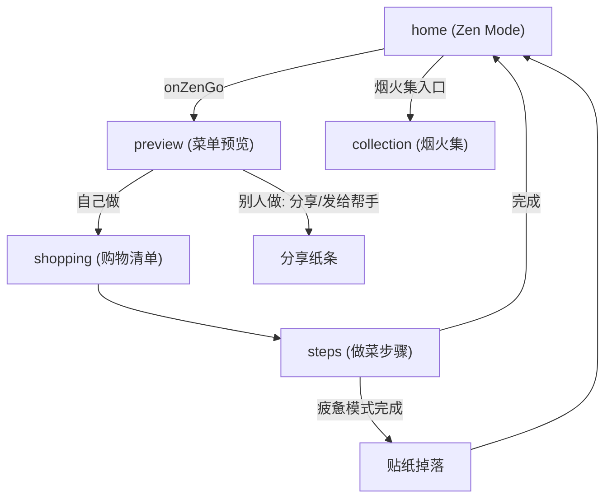

# TableSync 技术规格与 2026 需求实现状态

本文档为 TableSync 微信小程序的核心技术规格与 2026 版需求落地状态说明。需求原文见 [TableSync-核心逻辑与用户体验优化需求-2026.md](./TableSync-核心逻辑与用户体验优化需求-2026.md)。

---

## 1. 核心设计哲学

- **去 AI 感 (Invisible AI)**：不强调 AI 标签，强调「顺手」和「懂我」的直觉体感。
- **界面消失 (Interface ZERO)**：根据用户意图（心情、执行者）直接切换结果形态，消除冗余操作层级。
- **情绪共护**：根据用户疲惫程度提供治愈方案（如空气炸锅极简方案、纸条化交付）。

---

## 2. Zen Mode 状态机矩阵 (Logic Matrix)

算法与前端共同实现：`stressWeight` 通过 `preference.isTimeSave` 表达，`executorRole` 通过 `preference.who`（`caregiver` / `ayi`）表达。

| 维度 | 自己做 (Self) | 别人做 (Others) |
|------|---------------|-----------------|
| **心情还好 (Good)** | 追求成就感：保留精细化步骤，效率提升。**已实现**：常规菜单与步骤。 | 协作模式：清晰烹饪备忘录。**已实现**：preview 展示「给 Ta 的菜单」+ helper-card 纸条。 |
| **我很疲惫 (Tired)** | 极致减负：强制 `is_airfryer_alt`，优先空气炸锅/烤箱。**已实现**：menuGenerator 优先空气炸锅菜谱 + recipes 中 9 道 air_fryer 菜。 | 托付模式：「给 Ta 的小纸条」、操作难度极简。**已实现**：helper-card + formatForHelper 线性化步骤。 |

---

## 3. 页面导航与数据流

### 3.1 页面导航图

### 3.2 状态贯通机制

- **首页（无感角色切换）**：home 仅保留 **cookStatus**（还行 / 疲惫）选择；角色固定为「自己做」（cookWho 恒为 `self`，不再展示「谁来做」开关）。持久化：`wx.setStorageSync('zen_cook_status')`；`_buildZenPreference()` 产出 `preference.isTimeSave`、`preference.kitchenConfig.hasAirFryer`，`preference.who` 不传。
- **分享裂变**：用户点击分享时，`onShareAppMessage` 的 path 强制带 `role=helper`，接收方打开即进入 steps 执行者模式（纸条/阿姨模式），本机 preview 始终为标准视图。
- **preference** 通过 `getApp().globalData.preference` 与 storage 传递到 **preview → shopping → steps**。
- 各页根据 `preference.isTimeSave` 做差异化展示（空气炸锅标签、疲惫氛围等）；steps 根据 URL 参数 `role=helper` 进入执行者模式。

---

## 4. 需求模块实现状态

| 模块 | 状态 | 说明 |
|------|------|------|
| 视觉氛围 (Atmosphere) | 已完成 | home 全屏背景按 mood/executor 切换，0.8s 淡入淡出；preview/shopping 氛围与指标文案差异化。 |
| 空气炸锅强制 (is_airfryer_alt) | 已完成 | menuGenerator 疲惫模式优先空气炸锅池；recipes 新增 9 道 `cook_type: 'air_fryer'` 且 `is_airfryer_alt: true`。 |
| 纸条化交付 (Helper Memo) | 已完成 | components/helper-card 三大区（帮我准备 / 极简动作 / 情绪话术）；menuGenerator.formatForHelper(menus, preference, shoppingList)；preview 在 isHelperMode 下展示 helper-card。 |
| 全链路状态贯通 | 已完成 | preview/shopping/steps 读取 preference 与 Storage，展示 isHelperMode / isTiredMode 差异；steps 在 preference.who === 'caregiver' 时自动 isAyiMode。 |
| 烟火集与贴纸 | 已完成 | stickerCollection.js 数据层（9 种贴纸定义 + checkAllDropsOnComplete 批量检测 + 烹饪历史追踪）；sticker-drop 落叶飘落动画组件（队列 + 自动消失）；collection 页支持 emoji、可重复贴纸计数。详见 §10。 |
| preview 菜单区去重 | 已完成 | 今日菜单标题区仅保留主标题（今日菜单 / 给 Ta 的菜单），移除副标题 `previewMenuSubtitle` 与节奏芯片 `previewRhythmRings`，菜名仅在下方案品卡片展示，避免重复。 |
| 卖点后置与体验升级 | 已完成 | 首页移除「效率提升 +42%」/「空气炸锅模式」文案，改用天气感知问候；preview 页在菜品列表后展示串行 vs 并行统筹对比与烹饪顺序时间线；统筹逻辑抽至 utils/scheduleEngine.js；疲惫模式统筹区文案与色调差异化。详见 §5。 |
| 导入页入口与 UI | 已完成 | 导入页新增「加入混搭组餐」「随机配一桌」；英雄卡片、卡片化 section、AI 辅助信息合并、5 按钮布局。详见 §5.6。 |
| 今日菜单存储与导入菜兼容 | 已完成 | canSafelySlimMenus；含无 id 或 ext- 菜谱时存完整格式，避免 preview/steps 反序列化丢失（未知菜谱/步骤配料缺失）。详见 §5.7。 |
| 混合组餐页 UI 优化 | 已完成 | 菜名下标签去药丸化（来源微标签 + 纯文字 · 分隔）；底部三按钮改为横排，与 preview 等页风格统一。详见 §5.8。 |
| 需求探针与口味档案 | 已完成 | 首页 Vibe Card 内嵌需求探针（场景/口味，单选自动提交、多选含确认键）；跳过探针时降级到持久化 Taste Profile；口味模糊匹配（前二名差距≤30% 时双口味灵活搭配）。详见 §5.9。 |
| 口味画像卡片 | 已完成 | 烟火集页新增口味画像区：偏好口味进度条、偏好食材标签、忌口标签、累计做饭次数。详见 §5.13。 |
| 冰箱入口与 Store | 已完成 | 首页「我的冰箱」入口（🧊 + 动态提示：临期食材名 / 食材数量 / 空冰箱引导）；fridgeStore 管理本地库存；临期食材参与 AI 菜单推荐。详见 §5.11。 |
| 一句话微调（Tweak Bar） | 已完成 | 预览页底部输入栏「给主厨提要求」；提交后重新调用 smartMenuGen（userTweak 最高优先级）；智能关键词提取。详见 §5.10。 |
| 换菜不喜欢反馈 | 已完成 | 替换菜品时 ActionSheet 收集原因（太复杂/不喜欢食材/最近吃过/直接换）；持久化到 tasteProfile 并传入 smartMenuGen 做严格回避。详见 §5.10。 |
| 做完饭反馈卡 | 已完成 | 步骤页完成后「这桌菜怎么样？」卡片（三选项反馈）；反馈写入 tasteProfile；自动冰箱扣减。详见 §5.12。 |
| 肉类/烹饪方式/标签扩展 | 已完成 | 新增羊肉/鸭肉/贝类三种肉类 + 焗/烤(bake) 烹饪方式；辣度细分(spicy_sub)；16 种自动标签 + rankByAffinity 亲和度排序。详见 §5.14。 |
| 封面图链路重构 | 已完成 | HTTP 直链 → cloud:// FileID + getTempFileURL 运行时解析；顺序批次避免竞态。详见 §5.15。 |
| smartMenuGen 大升级 | 已完成 | 口味档案/冰箱临期/用户微调/不喜欢列表全面注入 AI prompt；候选池 500 + 按肉类均匀截断；dishHighlights 必填因果推理。详见 §5.10。 |
| 问候引擎升级 | 已完成 | 三层优先级（上下文感知 > 天气 > 通用）；支持深夜陪伴、冰箱临期、连续做饭等状态问候。详见 §5.16。 |
| 封面风格转变 | 已完成 | 暗调极简 → 暖光诱人丰富色彩；容器从深色陶瓷改为木/石面暖色餐具。 |
| stressWeight 评分因子 | 待扩展 | 当前 isTimeSave 已驱动过滤与空气炸锅优先，未单独暴露 stressWeight 数值。 |

---

## 5. 卖点后置与体验升级（2026）

> **目标**：将「效率提升」卖点从首页后置到用户已看到菜品内容的预览页，以串行 vs 并行对比与时间线呈现；首页用环境感问候替代数字指标；疲惫模式在统筹区做文案与视觉差异化。

### 5.1 首页降噪

- **移除**：home 页 Zen 面板下原「效率提升 +42%」（心情还好）与「空气炸锅模式 · 极致减负」（疲惫）文案。
- **实现**：删除 `home.js` 中 `zenBgIndicator` 的 data 与 `_updateZenBackground` 内所有 setData；删除 `home.wxml` 中 `zen-indicator` 节点；删除 `home.wxss` 中 `.zen-indicator` 相关样式。
- **填补**：首页 vibe 卡片沿用「今日日期 + 问候语」。问候语仅使用 `utils/vibeGreeting.js` 的 `vibeGreeting.pickGreeting(null)`（时段问候），不再接入天气；已移除 `utils/locationWeather.js` 及首页天气展示，并移除 app.json 中的定位/天气相关权限与 `requiredPrivateInfos`。

### 5.2 统筹预览公共模块

- **utils/scheduleEngine.js**：从 mix 页抽出的纯函数模块。
  - **computeSchedulePreview(selectedRecipes)**：输入菜谱数组（含 `prep_time`、`cook_minutes`、`cook_type`、`name`），返回 `totalTime`、`serialTime`、`savedTime`、`efficiency`、`cookingOrder`、`tips`、`devices`、`stoveCount` 等；炖煮/蒸制阶段带 `noWatch: true` 供预览页「无需看管」高亮。
  - **DEVICE_LABELS**：设备中文映射，供 mix 等使用。
- **mix.js**：改为 `require('../../utils/scheduleEngine.js')`，删除本地 `DEVICE_LABELS`、`COOK_TYPE_TO_DEVICE` 与 `computeSchedulePreview`，统一调用 `scheduleEngine.computeSchedulePreview(selectedRecipes)`。

### 5.3 预览页统筹对比区

- **展示时机**：仅在 `!isHelperMode && schedulePreview.savedTime > 0 && schedulePreview.efficiency > 10` 时展示，单道菜或两道全快炒（效率 &lt; 10%）不展示，符合「不炫技」克制原则。
- **数据**：`preview.js` 的 `_computePreviewDashboard(menus, pref)` 末尾根据当前菜单调用 `scheduleEngine.computeSchedulePreview(recipes)`，将结果挂在返回对象的 `schedulePreview` 上，并预计算 `parallelPercent = totalTime/serialTime*100` 供进度条宽度。所有会更新菜单的 setData（onLoad、handleShuffle、handleReplaceUnchecked、_recalcWithPreference、recommendExtra、_checkAndReplaceAvoidConflicts）均追加 `schedulePreview: dashboard.schedulePreview`，以整对象更新，避免全量 data 刷新。
- **视图**（preview.wxml，位于菜品列表与「再加个菜」之间）：
  - **串行 vs 并行对比**：上方灰色细条「常规烹饪 · XX 分钟」（删除线），下方彩色条「TableSync 统筹 · XX 分钟」，彩色条宽度为 `parallelPercent%`，带 `transition: width 0.8s ease` 换菜动画。
  - **效率印章**：正常模式显示「节省 XX 分钟」；疲惫模式显示「已开启极简统筹，减少 60% 手动操作」。
  - **烹饪顺序时间线**：与 mix 一致（先炖煮 → 同时蒸 → 最后快炒）；`noWatch` 阶段在疲惫模式下高亮。
- **样式**：preview.wxss 新增 `.schedule-compare-section`、对比条、`.efficiency-stamp`、`stampIn` 动画、时间线相关类（与 mix 对齐）。

### 5.4 疲惫模式差异化

- **统筹区**：`isTiredMode` 时背景暖黄、并行条渐变绿、时间与印章/提示文案为柔和绿；时间线中 `noWatch` 阶段（炖煮、蒸制）的 note 使用绿色高亮（`.timeline-item-no-watch .timeline-note`）。

### 5.5 涉及文件

| 文件 | 改动摘要 |
|------|----------|
| miniprogram/pages/home/home.js | 移除 zenBgIndicator；仅使用 vibeGreeting.pickGreeting(null)，已移除 locationWeather 与天气展示。 |
| miniprogram/pages/home/home.wxml | 删除 zen-indicator 节点；后续移除 vibe-weather 节点（见 §11.5）。 |
| miniprogram/pages/home/home.wxss | 删除 .zen-indicator 相关样式；后续删除 .vibe-weather（见 §11.5）。 |
| miniprogram/utils/scheduleEngine.js | 新建；computeSchedulePreview、DEVICE_LABELS；炖/蒸阶段 noWatch。 |
| miniprogram/pages/mix/mix.js | 引用 scheduleEngine，删除重复常量与函数。 |
| miniprogram/pages/preview/preview.js | 引用 scheduleEngine；data.schedulePreview；_computePreviewDashboard 内计算并挂 schedulePreview；6 处 setData 追加 schedulePreview。 |
| miniprogram/pages/preview/preview.wxml | 统筹对比区（门控、双条、印章、疲惫文案、时间线）。 |
| miniprogram/pages/preview/preview.wxss | 对比区、印章、时间线、疲惫模式覆盖样式。 |

### 5.6 导入页入口与 UI 优化（2026）

- **新增按钮**：导入菜谱预览页在「直接开始做」下增加「加入混搭组餐」「随机配一桌」；原「保存到我的菜谱」「重新导入」改为与上排并排的两半宽按钮。
- **加入混搭组餐**：将当前导入菜谱写入 `globalData._pendingMixRecipe` 并跳转 mix 页；mix 的 onLoad 已支持自动把 `_pendingMixRecipe` 加入已选。
- **随机配一桌**：以导入菜为第一道，`getTodayMenusByCombo(pref)` 生成其余道（排除同名），写入 `today_menus`（见 §5.7）、`today_menus_preference`、`cart_ingredients` 与 `menuPreview`，再跳转 preview。
- **UI**：菜名+来源+标签合并为 `.preview-hero-card`；食材/步骤区加 `.result-card` 卡片样式；置信度与耗时合并为一行 `.ai-meta-row`；底部 5 按钮分主按钮 + 两行并排。
- **涉及文件**：import.js（onGoMix、onGoPreviewWithMenu）、import.wxml（英雄卡片、action-row、action-btn-half）、import.wxss（hero-card、result-card、ai-meta-row、action-row/half、mix/preview 按钮样式）。

### 5.7 今日菜单存储格式与导入菜兼容（2026）

- **问题**：`today_menus` 存为 slim（仅 adultRecipeId）时，反序列化依赖 `getAdultRecipeById`，仅能解析内置菜谱 id。导入菜无 id 或 id 为 `ext-*` 时反序列化得到 `adultRecipe: null`，preview 显示「未知菜谱」，步骤与配料也丢失。
- **约定**：仅当菜单中**每道菜**的 `adultRecipe` 均有「内置可解析 id」（有 id 且不以 `ext-` 开头）时，才将 `today_menus` 存为 slim；否则一律存**完整菜单**（含完整 adultRecipe 对象）。
- **menuData.canSafelySlimMenus(menus)**：新增函数，遍历 menus，若任一项无 `adultRecipe.id` 或 id 以 `ext-` 开头则返回 false，否则返回 true。供写入 storage 前判断。
- **调用点**：  
  - **import.js**（onGoPreviewWithMenu）：写 `today_menus` 前 `canSafelySlimMenus(menus)` 为 true 才 `serializeMenusForStorage`，否则 `JSON.stringify(menus)`。  
  - **preview.js**：① onLoad 首次写回；②「开始做饭」流程写 storage；③ onChangeAdultCount 持久化（若存在）。三处均先 `canSafelySlimMenus(menus)`，为 true 才写 slim，否则写完整 menus。**实现注意**：「开始做饭」流程中写 `today_menus` 时必须使用上述判断，否则含导入菜的菜单会被存成 slim 导致 steps/preview 反序列化后首道显示「未知菜谱」、步骤与配料丢失。
- **涉及文件**：menuData.js（canSafelySlimMenus）、import.js、preview.js。

### 5.8 混合组餐页 UI 优化（2026）

- **目标**：减少菜名下方标签视觉凌乱感，底部操作栏与 preview 等页保持风格一致（横排、单行）。
- **标签**：原 `recipe-card-tags` 内多枚药丸式标签改为 `recipe-card-meta`——来源保留为微标签（「原生」/「导入」、小圆角 8rpx），烹饪方式与荤素改为纯文字，用 `·` 分隔，无边框与背景。
- **底部操作栏**：`.bottom-actions` 由竖排改为横排（`flex-direction: row`）；三按钮顺序为「购物清单」「让别人做」「开始做」，主操作「开始做」置右且 `flex: 1.3`；按钮高度统一 84rpx，字号 26rpx；容器 `padding-bottom` 由 280rpx 调整为 140rpx。
- **涉及文件**：mix.wxml（recipe-card-meta 结构、bottom-actions 按钮顺序与文案）、mix.wxss（.recipe-card-meta、.recipe-card-source 小圆角、.recipe-card-meta-text/dot、.bottom-actions 横排与 .action-btn flex/高度）。

### 5.9 需求探针与 Zen 偏好降级（含口味模糊匹配）

- **背景**：首页需求探针（场景/口味等）内嵌在 Vibe Card 中；用户可直接点「想想吃什么」不回答探针。为保证仪式感不变成强迫感，未回答时降级到持久化 Taste Profile，且当口味档案中前两名分数接近时采用「双口味灵活搭配」的人情味策略。
- **跳过探针时的降级顺序**：Session 本次选择 &gt; 本地持久化（`tasteProfile.get()` 的 scene / flavorAffinity）&gt; 默认配置（如 `getSceneConfig()` 的 couple）。`onZenGo` 中若 `!isSessionAnswered('taste')` 仍从 `profile.flavorAffinity` 通过 `getTopFlavors` / `getFlavorHint` 构建偏好并传给 `smartMenuGen`。
- **口味模糊匹配**：当 `flavorAffinity` 中**第二名得分 ≥ 第一名的 70%** 时视为模糊（如辣 7、清淡 5 → 5/7≥0.7）。
  - **tasteProfile.getTopFlavors(affinity)**：返回 `{ top, second, ambiguous }`，阈值 0.7；用于 `_buildZenPreference` 与 `buildSessionSummary`。
  - **preference 新增字段**：`topFlavorKey`、`secondFlavorKey`（仅 ambiguous 时非空）、`flavorAmbiguous`。
  - **AI Prompt（prompt-builder.js）**：当 `flavorAmbiguous` 且两个口味均有语义时，注入「用户平时爱吃 X 和 Y，两种方向都可以，请在套餐中灵活搭配」，并分别列出两方向的烹饪语义；否则沿用单口味语义。
  - **确认文案（probeEngine.buildSessionSummary）**：模糊态展示「偏好辣味或清淡」；非模糊态展示「偏好辣味」。
- **涉及文件**：`miniprogram/data/tasteProfile.js`（getTopFlavors）、`miniprogram/pages/home/home.js`（_buildZenPreference 传 secondFlavorKey / flavorAmbiguous）、`cloudfunctions/smartMenuGen/lib/prompt-builder.js`（ambiguous 双口味分支）、`miniprogram/logic/probeEngine.js`（buildSessionSummary 用 getTopFlavors 展示「偏好X或Y」）。

### 5.10 预览页增强：一句话微调、换菜反馈与 smartMenuGen 大升级

#### 一句话微调（Tweak Bar）

- **交互**：预览页底部新增输入栏「给主厨提要求（如：别放葱 / 想吃鱼）」；输入后出现「重新推荐」按钮（animated reveal）。
- **提交**：触发 `smartMenuGen` 云函数调用，`userTweak` 参数为最高优先级，AI prompt 中以「用户特别要求」置顶。
- **智能关键词**：检测肉类关键词，匹配到的肉类候选 boost 至候选池顶部。

#### 换菜不喜欢反馈

- **交互**：替换菜品时弹出 ActionSheet，四项理由：「太复杂了」「不喜欢这食材」「最近吃过了」「直接换」。
- **持久化**：非跳过理由通过 `tasteProfile.addDislikedRecipe(id, reason)` 持久化；disliked recipe IDs 和菜名作为 `dislikedDishNames` 传入 `smartMenuGen`，prompt 中标记「严格回避」。

#### smartMenuGen 云函数大升级

| 维度 | 变更 |
|------|------|
| 新参数 | `dislikedDishNames`、`fridgeExpiring`、`heroIngredient`、`userTweak` |
| 口味档案注入 | flavorHint、preferredMeats、urgentIngredient、ambiguous 双口味灵活搭配 |
| 新 prompt 段落 | 「用户特别要求」「冰箱临期食材」「今日主角食材」「近期不想吃的菜」「口味语义对齐」「P3.5 口味档案适配」 |
| 候选池 | 上限从 80 → 500；超过 500 时按肉类均匀截断 |
| 候选数据 | 新增「主料」标签、cook_minutes、tags |
| dishHighlights | 从可选改为 **必填**；须提供因果推理（关联主角食材/口味/天气），禁止泛泛的「好吃」「推荐」 |
| 口味语义对齐 | 抽象口味标签翻译为烹饪指令（如 `light` → 偏好清蒸、白灼、水煮） |

#### 推荐理由兜底

- 新增 `buildReasonFallback(recipe)`：当 AI 未返回 dishHighlight 时，从 cook_type hint + cook_minutes 生成兜底推荐理由（如「大火快炒，锅气十足」「仅需12分钟」）。

#### 忌口同步

- 用户在预览页切换忌口胶囊时，变更同步持久化到 `tasteProfile.setAvoidList()`。

#### 涉及文件

| 文件 | 改动摘要 |
|------|----------|
| miniprogram/pages/preview/preview.js | tweak 输入与提交、ActionSheet 换菜反馈、buildReasonFallback、忌口同步 tasteProfile |
| miniprogram/pages/preview/preview.wxml | 底部 tweak 输入栏与重新推荐按钮 |
| miniprogram/pages/preview/preview.wxss | tweak-bar、send-btn 动画样式 |
| cloudfunctions/smartMenuGen/index.js | 新参数接收、口味档案传递 |
| cloudfunctions/smartMenuGen/lib/prompt-builder.js | 新 prompt 段落、口味语义对齐、双口味分支、dishHighlights 规则 |

### 5.11 冰箱入口与 fridgeStore

- **首页入口**：「我的冰箱」🧊 图标 + 动态提示文案：
  - 空冰箱：「记录食材，AI 帮你优先消耗临期的」
  - 有临期食材：「XX、YY 快过期了，该吃掉了」
  - 其他：「冰箱里有 N 种食材」
- **fridgeStore.js**：管理本地冰箱库存，API 包括 `getCount()`、`getExpiringSoon(days)`、`getExpiringNames(days)`、`consumeByCategory(cat)`。
- **AI 联动**：临期食材作为 `fridgeExpiring` 传入 smartMenuGen prompt；影响 `heroIngredient` 选取。
- **做饭后自动扣减**：步骤页完成烹饪后，自动按已用食材类别从冰箱 store 中扣减。
- **涉及文件**：`miniprogram/pages/home/home.wxml`（冰箱入口）、`home.js`（动态提示文案）、`miniprogram/data/fridgeStore.js`（新建）、`miniprogram/pages/fridge/`（新建冰箱管理页）、`miniprogram/app.json`（注册冰箱页）。

### 5.12 做完饭反馈卡与口味学习

- **交互**：步骤页完成烹饪后，反馈卡片 slide-up 动画：「这桌菜怎么样？」+ 三选项 😋 很喜欢 / 🙂 还不错 / 😐 不太对。
- **数据写入**：通过 `tasteProfile.applyPostCookFeedback(feedback, recipes)` 将反馈应用到口味档案（正反馈增强口味/食材亲和度，负反馈不会直接降低但影响后续排序）。
- **额外行为**：
  - 记录 `last_cook_dishes` 到 storage，供问候引擎回顾参考。
  - 调用 `tasteProfile.recordCookComplete()` 更新 `totalCooks` 计数。
  - 自动冰箱扣减：`fridgeStore.consumeByCategory()` 扣除已用食材类别。
- **涉及文件**：`steps.js`（反馈卡逻辑、扣减调用）、`steps.wxml`（反馈卡 UI）、`steps.wxss`（fade-in 动画样式）。

### 5.13 口味画像卡片（烟火集页）

- **展示内容**：
  - 口味偏好进度条（视觉条形图，取 top N 口味及其得分占比）
  - 偏好食材标签（如鸡肉、猪肉、鱼类…）
  - 忌口标签（红色调）
  - 累计做饭次数徽章
- **数据来源**：`tasteProfile.getTastePortrait()` 返回 `{ topFlavors, preferredMeats, avoidList, totalCooks }`。
- **涉及文件**：`collection.js`（调用 getTastePortrait）、`collection.wxml`（画像卡片 UI）、`collection.wxss`（偏好条、标签样式）。

### 5.14 数据模型扩展：肉类、烹饪方式与标签系统

#### 新增肉类与烹饪方式

| 类型 | 新增 | 说明 |
|------|------|------|
| 肉类 | `lamb`（羊肉）、`duck`（鸭肉）、`shellfish`（贝类） | constant.js 全局映射、normalizer、recipe-extractor 均已适配 |
| 烹饪方式 | `bake`（焗/烤） | 加入 COOK_TYPE、normalizer、cloud 验证 |
| 辣度细分 | `spicy_sub`: `mala`（麻辣）/ `xianla`（鲜辣）/ `xiangla`（香辣，默认） | 新 enum |
| 过敏原 | `cilantro`（香菜/芫荽） | ALLERGEN_TO_MAIN_NAMES 新增 |

- 辣味过敏原过滤升级：除 `flavor_profile` 外，还检测食材名（辣椒、花椒、豆瓣酱等）。
- **recipe schema 新增字段**：`tags[]`、`ingredient_group`、`spicy_sub`。

#### 菜谱标签系统

- **16 种标签词汇**：`late_night` / `ultra_quick` / `comfort` / `party` / `quick` / `light` / `high_protein` / `spicy` / `vegetarian` / `no_oil` / `steamed` / `salty_umami` / `hearty` / `soup` / `stir_fry` / `baby_friendly`。
- **defaultTagsForRecipe(r)**：根据烹饪时间、口味、肉类、菜型等自动生成标签。
- **ensureRecipeTags(recipe)**：为缺失标签的菜谱补上自动生成标签；所有 `getAdultRecipesList()` / `getBabyRecipesList()` 结果经此包装。
- **rankByAffinity(recipes, profile)**：基于 tasteProfile 的口味与食材亲和度对候选菜谱排序，用于 _buildZenPreference 中的智能候选池。

#### 涉及文件

| 文件 | 改动摘要 |
|------|----------|
| miniprogram/config/constant.js | SPICY_SUB enum；MEAT_TYPE/VALID_MEATS/MEAT_LABEL_MAP/MEAT_KEY_MAP 扩展 lamb/duck/shellfish；COOK_TYPE.BAKE；cilantro 过敏原 |
| miniprogram/data/menuGenerator.js | 16 种标签词汇；defaultTagsForRecipe；ensureRecipeTags；rankByAffinity |
| miniprogram/data/recipeSchema.js | tags/ingredient_group/spicy_sub 字段 |
| miniprogram/pages/mix/mix.js | 筛选项新增 lamb/duck/shellfish |
| cloudfunctions/recipeImport/index.js | bake cook_type 验证；lamb/duck/shellfish 肉类 |
| cloudfunctions/recipeImport/lib/normalizer.js | bake 归一化映射（焗、烤）；lamb/duck/shellfish 关键词检测 |
| cloudfunctions/recipeImport/lib/recipe-extractor.js | 系统 prompt 扩展新肉类与烹饪方式 |

### 5.15 封面图链路重构（HTTP → Cloud FileID）

- **移除**：`getRecipeCoverHttpUrl`、`HTTP_STORAGE_BASE`、`DEFAULT_COVER_HTTP_URL` 全部移除。
- **新方案**：使用 `cloud://` FileID，运行时通过 `getTempFileURL` 解析为临时链接。
- **首页**：cloud images 使用 `cloud://` FileID，onLoad 后 500ms 延迟批量解析。
- **预览页**：移除 imageLib 缓存层，简化为直接 `getTempFileURL` 调用。
- **混合组餐页**：从 `_coverHttpUrl` 改为 `_coverCloudUrl` + 懒解析 `_coverTempUrl`；WXML 仅展示 `_coverTempUrl`。
- **imageLib.batchResolveTempUrls**：从并行批次改为**顺序批次**，避免竞态条件。
- **涉及文件**：`recipeCoverSlugs.js`、`home.js`、`preview.js`、`mix.js`、`imageLib.js`。

### 5.16 问候引擎升级（vibeGreeting）

- **三层优先级**：Context-aware > Weather template > Generic fallback。
- **新增 `_contextGreeting(ctx)` 函数**：
  - 深夜（22:00-5:00）：「辛苦了，忙到现在…」
  - 冰箱临期食材：「冰箱里的XX该用掉了…」
  - 首次访问：「你好呀，告诉我今晚几个人吃…」
  - 连续做饭（3+ 天）：「连续第N天下厨…」
  - 上次菜品回顾：「上次的XX还满意吗？」
- **`pickGreeting()` 新增 `context` 可选参数**，由首页传入上下文信息（fridgeExpiringNames、visitCount、lastCookDishes 等）。
- **涉及文件**：`miniprogram/utils/vibeGreeting.js`。

### 5.17 Zen 偏好构建重写（_buildZenPreference）

- **完全重写**：不再使用硬编码 2 人默认，改为从 Taste Profile 动态构建。
- **场景配置**：`tasteProfile.getSceneConfig()` 返回成人数/荤素汤道数。
- **饮食风格**：从 flavorAffinity 推断（`inferDietStyle()`）。
- **偏好肉类**：从 ingredientAffinity 推断（`inferPreferredMeats()`）。
- **厨房设备**：从持久化 profile 读取；疲惫模式自动覆盖为空气炸锅。
- **新增 preference 字段**：`preferredMeats`、`flavorHint`、`topFlavorKey`、`secondFlavorKey`、`flavorAmbiguous`、`urgentIngredient`、`fridgeExpiring`、`heroIngredient`。
- **智能候选池**：按偏好过滤 → 移除已 disliked → 按亲和度排序 → 截断至 500。
- **涉及文件**：`miniprogram/pages/home/home.js`。

---

## 6. 组件清单

| 组件 | 路径 | 用途 |
|------|------|------|
| helper-card | components/helper-card/helper-card | 「别人做」模式下的纸条化菜单（The Prep / The Action / The Heart）。 |
| sticker-drop | components/sticker-drop/sticker-drop | 贴纸掉落弹层，从 steps 完成回首页时展示。 |

---

## 7. 关键数据与接口

- **formatForHelper(menus, preference, shoppingList)**  
  - 位置：`miniprogram/data/menuGenerator.js`  
  - 返回：`{ prepItems: [{ name, amountDisplay }], actions: [{ text }], heartMessage: string }`

- **stickerCollection.checkAllDropsOnComplete(ctx)**  
  - 位置：`miniprogram/data/stickerCollection.js`  
  - 参数：`{ isTired: boolean, isHesitant: boolean, recipeNames: string[] }`  
  - 返回：`[{ stickerId, name, emoji }]` 新掉落贴纸列表  
  - 内部依次检测：first_cook → tired_done → night_cook/morning_cook → hesitant_go → favorite_dish → lucky_cat

- **stickerCollection.tryDropSticker(stickerId, source)**  
  - 位置：`miniprogram/data/stickerCollection.js`  
  - 支持 repeatable 贴纸（如 lucky_cat，上限 5 次）

- **globalData.pendingStickerDrop**  
  - **数组格式**：`[{ stickerId, name, emoji }]`（兼容旧单对象格式）  
  - 步骤页完成时由 `checkAllDropsOnComplete` 写入；home 的 onShow 读取并传入 sticker-drop 组件队列展示。

- **globalData._hesitantStart**  
  - home 页 onZenGo 中检测到犹豫（停留 > 60s 或切换状态 >= 3 次）时设为 true；steps 完成时读取并传入贴纸检测。

- **scheduleEngine.computeSchedulePreview(recipes)**  
  - 位置：`miniprogram/utils/scheduleEngine.js`  
  - 输入：菜谱数组（含 prep_time、cook_minutes、cook_type、name）。  
  - 返回：totalTime、serialTime、savedTime、efficiency、cookingOrder、tips、devices、stoveCount 等；cookingOrder 中炖/蒸项带 noWatch: true。

- **menuData.canSafelySlimMenus(menus)**  
  - 位置：`miniprogram/data/menuData.js`  
  - 用途：写 `today_menus` 前判断是否可安全存为 slim。任一道菜 `adultRecipe` 无 id 或 id 以 `ext-` 开头则返回 false，否则返回 true。为 false 时应存完整菜单，避免反序列化时导入菜丢失。

- **tasteProfile.getTopFlavors(affinity)**  
  - 位置：`miniprogram/data/tasteProfile.js`  
  - 返回：`{ top: string|null, second: string|null, ambiguous: boolean }`。当第二名得分 ≥ 第一名 70% 时 `ambiguous` 为 true，用于 Zen 偏好与 AI 双口味灵活搭配（见 §5.9）。

- **tasteProfile.get() / save() / update()**  
  - 位置：`miniprogram/data/tasteProfile.js`  
  - 持久化 Storage Key：`taste_profile`  
  - 字段分类：volatile（session-only：scene/headcount/urgentIngredient）+ persistent（flavorAffinity/ingredientAffinity/avoidList/kitchenConfig/visitCount/totalCooks 等）。  
  - 详细字段定义见 `miniprogram/logic/DATA_PROTOCOL.md`。

- **tasteProfile.getTastePortrait()**  
  - 位置：`miniprogram/data/tasteProfile.js`  
  - 返回：`{ topFlavors, preferredMeats, avoidList, totalCooks }`，供烟火集口味画像卡片使用。

- **tasteProfile.applyPostCookFeedback(feedback, recipes)**  
  - 位置：`miniprogram/data/tasteProfile.js`  
  - 根据用户反馈（great/ok/meh）调整 flavorAffinity 和 ingredientAffinity 权重。

- **tasteProfile.addDislikedRecipe(id, reason) / getDislikedRecipeIds() / getDislikedRecipeNames()**  
  - 位置：`miniprogram/data/tasteProfile.js`  
  - 管理用户不喜欢的菜品列表，传入 smartMenuGen 做严格回避。

- **probeEngine.resetSession() / isSessionAnswered(probeId) / buildSessionSummary()**  
  - 位置：`miniprogram/logic/probeEngine.js`  
  - 管理探针的 session 生命周期和回答状态；构建确认文案（含口味模糊态「偏好X或Y」）。

- **fridgeStore.getCount() / getExpiringSoon(days) / getExpiringNames(days) / consumeByCategory(cat)**  
  - 位置：`miniprogram/data/fridgeStore.js`  
  - 管理本地冰箱库存；临期食材供首页提示与 AI 菜单推荐。

- **menuGenerator.defaultTagsForRecipe(r) / ensureRecipeTags(recipe) / rankByAffinity(recipes, profile)**  
  - 位置：`miniprogram/data/menuGenerator.js`  
  - 自动标签生成与基于口味档案的候选排序。

- **vibeGreeting.pickGreeting(weather, context)**  
  - 位置：`miniprogram/utils/vibeGreeting.js`  
  - 三层优先级问候：上下文感知（深夜/冰箱/连续做饭/首访/上次菜品） > 天气 > 通用。

---

## 8. 参考文档

- 需求汇总：[TableSync-核心逻辑与用户体验优化需求-2026.md](./TableSync-核心逻辑与用户体验优化需求-2026.md)
- 厨房设备与空气炸锅逻辑：[design-kitchen-devices-adaptation.md](./design-kitchen-devices-adaptation.md)

---

## 9. 云端菜谱与步骤/购物清单修复（AI 必读）

> **用途**：后续在其他窗口或会话中修改相关逻辑时，请先阅读本节，避免破坏已修复行为或重复修改。  
> **问题背景**：用户希望从云端查看菜谱的食材与步骤；本地 `recipes.js` 为精简版（无 steps/ingredients），完整数据来自云数据库。若同步时机、分页或缓存策略不当，会出现「步骤/食材缺失」「重新加载无反应」等问题。

### 9.1 数据流与原则

- **步骤与食材来源**：优先从 `cloudRecipeService` 的内存/存储缓存读取；缓存来自 `syncFromCloud()` 拉取的云数据库 `recipes` 集合。本地 `recipes.js` 仅作无网络或云端无数据时的兜底（且无 steps/ingredients）。
- **关键原则**：凡使用「今日菜单」或「混合组餐」等菜单数据生成步骤或购物清单时，**必须按菜谱 id 从当前缓存重新解析**（`getAdultRecipeById` / `getBabyRecipeById`），不能直接使用页面或 globalData 里保存的旧菜谱引用（可能是同步前拿到的残缺对象）。

### 9.2 cloudRecipeService.js 修改要点

| 修改点 | 说明 |
|--------|------|
| 分页拉取 | 小程序端云数据库 `get()` 单次最多返回 **20 条**。使用 `pageSize = 20`，且**每次分页重新** `collection.where(...).skip(skip).limit(20).get()`，不可复用同一 query 对象。 |
| 先更新内存再写存储 | 同步成功后**先**赋值 `_memoryCache.adultRecipes` / `babyRecipes`，**再**调用 `saveToStorage()`。这样即使本地存储因体积超限（如 10MB）写入失败，本次会话仍能使用完整数据。 |
| 安全网条件 | 仅当 **合并后条数为 0**（`mergedAdult.length === 0`）时才用本地 `recipes.js` 做 fallback 合并。若云端有数据（如 20 条），不再按「少于本地 50%」触发安全网，避免用无 steps 的本地数据冲掉云端数据。 |
| 存储失败日志 | `saveToStorage` 内对写入失败做 try/catch，并 `console.warn`，便于排查超限等问题。 |

### 9.3 menuData.js 修改要点

- **generateSteps**：当存在 `todayMenus` 时，先用 `resolveMenu` 对每条菜单按 `adultRecipe.id` / `babyRecipe.id` 调用 `getAdultRecipeById` / `getBabyRecipeById`，得到带 steps/ingredients 的菜谱，再基于 `menusWithFreshRecipes` 调用 `generator.generateSteps` / `generateUnifiedSteps` 和 `generateShoppingListFromMenus`。这样无论菜单是何时生成的，步骤与购物清单都基于**当前缓存**。
- 若某 id 在缓存中找不到带 steps 的菜谱，会打 `console.warn('[menuData.generateSteps] 缓存条数=..., 未找到带步骤的菜谱 id=...')` 便于排查。

### 9.4 步骤页 steps.js / steps.wxml 修改要点

| 修改点 | 说明 |
|--------|------|
| 自动重试 | 当生成的步骤为「需联网获取」提示（一条步骤且 `_isOfflineHint === true` 或 title 为「提示」且 details 含「联网」）时，约 **800ms 后自动调用** `retryLoadStepsFromCloud()`，无需用户点击。 |
| 重新加载按钮 | 按钮使用 `type="plain"`、`catchtap="retryLoadStepsFromCloud"`，不限制 `_source`，任意入口均可触发。若接口返回「同步进行中」，则约 **2.5s 后再试一次**。 |
| retryLoadStepsFromCloud 按来源处理 | **menu**：清空 `app.globalData.todayMenus` 后调用 `menuData.generateSteps`（会从 storage 的 today_menus 重新解析）。**mix**：用 `_mixMenus`（或 globalData.mixMenus）逐条按 id 解析后 `generateUnifiedSteps` / `generateSteps`。**scan**：用 `_scanRecipeIds` 调用 `menuData.generateStepsFromRecipeIds` 再更新步骤与 `_scanMenus`。**ayi**：存 `_ayiAdultCount`，用 `_ayiRecipeIds` 调用 `generateStepsFromRecipeIds`，写回 `todayMenus` 后 `generateSteps(..., { forceLinear: true })`。**import** 仅同步并 toast「已同步，请返回重新进入」。 |
| 展示 | 步骤缺失时展示「重新加载步骤」按钮、加载中文案及同步错误 `stepsSyncError`；`_updateView` 中根据是否离线提示设置 `showOfflineHint`。 |

### 9.5 购物清单页 shopping.js 修改要点

| 修改点 | 说明 |
|--------|------|
| updateList 数据源顺序 | ① 优先用**今日菜单**：`app.globalData.todayMenus` 或从 storage 的 `today_menus` 经 `deserializeMenusFromStorage` 得到；对每条菜单按 id 解析后 `generateShoppingListFromMenus`。② 若无今日菜单或未得到清单，则用 **mix**：若存在 `app.globalData.mixMenus`，同样按 id 解析后 `generateShoppingListFromMenus`。③ 再否则用已有 `cart_ingredients` 或 `menuData.generateShoppingList(pref)`。 |
| 写回 | 由 ① 或 ② 得到非空清单时，写入 `wx.setStorageSync('cart_ingredients', ...)` 并 `app.globalData.mergedShoppingList = ...`。 |
| onShow | `onShow` 中先执行 `this.updateList()`，再按 storage 做 setData，保证从步骤页等返回时用最新缓存刷新清单（含今日菜单与 mix 两路）。 |

### 9.6 步骤页入口与 source

| 入口 | source | 跳转示例 | 重试时数据来源 |
|------|--------|----------|----------------|
| 今日菜单 / 购物清单 | （无） | `/pages/steps/steps` | todayMenus（清空后从 storage 再解析） |
| 混合组餐 | mix | `?source=mix&recipeNames=...` | globalData.mixMenus，按 id 解析 |
| 扫描/冰箱组餐 | scan | `?source=scan&recipeIds=...` | _scanRecipeIds → generateStepsFromRecipeIds |
| 阿姨/分享卡片 | ayi | `?source=ayi&recipeIds=...&adultCount=...` | _ayiRecipeIds + _ayiAdultCount → generateStepsFromRecipeIds + forceLinear |
| 导入菜谱 | import | `?source=import&recipeName=...` | 仅同步 + toast，不按 id 解析（数据来自用户导入） |

### 9.7 涉及文件一览

- `miniprogram/utils/cloudRecipeService.js`：拉取、合并、内存/存储顺序、安全网、saveToStorage 日志。
- `miniprogram/data/menuData.js`：generateSteps 内 todayMenus 的 resolveMenu + menusWithFreshRecipes。
- `miniprogram/pages/steps/steps.js`：onLoad 自动重试、retryLoadStepsFromCloud（menu/mix/scan/ayi）、_ayiAdultCount 存储。
- `miniprogram/pages/steps/steps.wxml`：showOfflineHint、重新加载按钮、stepsReloading、stepsSyncError。
- `miniprogram/pages/steps/steps.wxss`：offline-reload 区域样式。
- `miniprogram/pages/shopping/shopping.js`：updateList 的今日菜单 + mixMenus 按 id 解析，onShow 调用 updateList。
- `miniprogram/pages/preview/preview.js`：helper 模式下 onLoad 后调用 `syncCloudRecipes()`，同步完成后用 `generateStepsFromRecipeIds` + `formatForHelperFromResult` 刷新 helperData，保证纸条步骤来自当前缓存。

### 9.8 分享链路与 preview 纸条的云端步骤

- **分享进入的 helper-card（steps 页）**：入口为 `role=helper&recipeIds=...`，步骤由 `generateStepsFromRecipeIds(ids, pref)` 生成，内部通过 `getAdultRecipeById` 从 cloudRecipeService 缓存取菜谱。若缓存暂无完整步骤（如首次打开、未同步），会展示「需联网获取」；**约 800ms 后自动调用** `retryLoadStepsFromCloud()`（与 menu/mix/scan 一致，不排除 helper 入口），同步后按 ayi 分支重新生成步骤并刷新视图。
- **分享前用户看到的 preview 纸条**：helper 模式下先用当前缓存（含本地或已同步云端）构建 helperData；**onLoad 完成后会再调一次** `syncCloudRecipes()`，同步成功后用 `generateStepsFromRecipeIds` + `formatForHelperFromResult` 重算 helperData 并 setData，从而在云端数据就绪后纸条中的「极简动作」与分享打开后的步骤一致且为完整步骤。

---

## 10. 烟火集贴纸系统（2026 扩展）

> **设计哲学**：在用户的情感波动点给予微小而精美的肯定，强化"生活仪式感"与"被陪伴感"。贴纸触发不打断用户流程——像落叶一样从屏幕顶部飘下，轻柔地停在角落。

### 10.1 贴纸定义（9 种）

| ID | 名称 | Emoji | 类别 | 触发条件 | 可重复 | 设计意图 |
|----|------|-------|------|----------|--------|----------|
| first_cook | 初见火光 | 🔥 | milestone | 首次完成烹饪 | 否 | 降低新用户流失，"我其实很会生活"的暗示 |
| tired_done | 疲惫治愈 | 🛋️ | milestone | 疲惫模式完成烹饪 | 否 | 肯定"即使累了也愿意做饭"的自我关怀 |
| share_memo | 纸条传情 | 💌 | social | 成功分享给帮手 | 否 | 鼓励社交裂变 |
| night_cook | 月亮守望者 | 🌙 | time | 22:00–2:00 完成 | 否 | 深夜陪伴感 |
| morning_cook | 晨曦主厨 | 🌅 | time | 6:00–9:00 完成 | 否 | 清晨能量感 |
| hesitant_go | 心定时刻 | 🍃 | emotion | 首页犹豫后（停留>60s 或切换>=3次）完成 | 否 | 治愈决策焦虑 |
| favorite_dish | 偏爱这一味 | ❤️ | habit | 同一道菜制作 3 次 | 否 | 用户对菜品的"主权感"，提升复用 |
| lucky_cat | 流浪的小猫 | 🐱 | surprise | 5% 随机掉落 | 是(×5) | 不确定性奖励，维持每日打开动机 |
| monthly_all | 月度全勤 | 📅 | milestone | 月内每周至少烹饪 1 次（预留） | 否 | 长期留存 |

### 10.2 触发流程

1. **steps.js** 的两处完成路径（`markCurrentCompleted` / `markCompleted`）统一调用 `stickerCollection.checkAllDropsOnComplete(ctx)`。
2. `checkAllDropsOnComplete` 按顺序检测所有条件，返回新掉落贴纸数组。
3. 写入 `getApp().globalData.pendingStickerDrop`（数组格式）。
4. 用户返回 home 页，`onShow` 读取队列，传入 `sticker-drop` 组件。

### 10.3 犹豫检测（心定时刻）

- **home.js** 的 `onShow` 记录 `_homeShowTime` 和重置 `_toggleCount`。
- `onToggleCookStatus` 每次切换时 `_toggleCount++`。
- `onZenGo` 中计算停留时长和切换次数，满足任一条件（`> 60s` 或 `>= 3 次`）则写 `globalData._hesitantStart = true`。
- steps 完成时读取该标记传入贴纸检测。

### 10.4 烹饪历史（偏爱这一味）

- Storage Key：`cook_recipe_history`，格式 `{ [recipeName]: count }`。
- 每次完成烹饪时由 `checkAllDropsOnComplete` 自动更新。
- 某道菜 count 达到 3 时触发 `favorite_dish`。

### 10.5 UI 表现 — 落叶飘落动画

- **取消全屏遮罩**：不打断用户视觉焦点。
- **飘落轨迹**：从右上角出发，1.2s 内沿 S 形曲线飘到屏幕右侧中下方（`leafFall` 关键帧：左右摇摆 + 轻微旋转 + 渐入）。
- **落地停留**：微弹安顿（`leafSettle`，0.4s），展示"获得贴纸"标签和名称，停留 2.5s。
- **退场**：向右飘出淡出（`leafLeave`，0.5s）。
- **队列播放**：多个贴纸依次飘落，间隔 0.4s。用户点击可提前收下。

### 10.6 收集展示（collection 页）

- 2 列网格，每格展示 emoji + 名称 + 描述。
- 已获得：暖黄渐变背景 + 赭色边框；未获得：灰色半透明。
- 可重复贴纸（如 lucky_cat）显示 `×count/maxCount` 徽章。
- 顶部显示进度 `totalEarned / totalDefs`。

### 10.7 涉及文件

| 文件 | 改动摘要 |
|------|----------|
| miniprogram/data/stickerCollection.js | 9 种贴纸定义；checkAllDropsOnComplete 批量检测；countSticker 支持可重复；loadCookHistory / saveCookHistory 烹饪历史。 |
| miniprogram/components/sticker-drop/sticker-drop.js | 重写为队列组件：properties.queue 数组；_showNext 依次播放；_dismiss 自动退场。 |
| miniprogram/components/sticker-drop/sticker-drop.wxml | 落叶飘落结构：sticker-leaf + animPhase 控制；emoji + info 标签。 |
| miniprogram/components/sticker-drop/sticker-drop.wxss | leafFall / leafSettle / leafLeave / infoFadeIn 关键帧动画；无遮罩浮层。 |
| miniprogram/pages/home/home.js | onShow 犹豫追踪（_homeShowTime / _toggleCount）；onZenGo 犹豫检测；pendingStickerDrop 改数组；onStickerDropClose 清空队列。 |
| miniprogram/pages/home/home.wxml | sticker-drop 组件改用 queue 属性。 |
| miniprogram/pages/steps/steps.js | 两处完成路径改用 checkAllDropsOnComplete；传入 isTired / isHesitant / recipeNames。 |
| miniprogram/pages/collection/collection.js | 支持 emoji / repeatable count / totalEarned 进度；onShow 写入 `last_view_collection_time`。 |
| miniprogram/pages/collection/collection.wxml | emoji 展示、可重复贴纸计数徽章、进度条。 |
| miniprogram/pages/collection/collection.wxss | 进度文字、计数徽章样式。 |

### 10.8 悬浮书脊入口 (The Floating Spine)

> **设计意图**：烟火集的入口不应隐藏在页面底部，它应该始终可见、有质感、有情绪反馈。书脊暗示用户——「你所有的努力最终都会汇聚到这里」。

#### 结构

- **位置**：首页右侧中段，`position: fixed`，脱离页面滚动流。
- **外观**：极窄竖条（52rpx 宽），带皮革质感渐变背景，左侧圆角贴边于屏幕右侧。
- **火漆印章**：顶部 38rpx 圆形印章，红色径向渐变，暗示勋章微缩版。
- **竖排文字**：`writing-mode: vertical-rl`，「烟火集」三字半透明浮于皮面。

#### 动态反馈（替代红点）

| 状态 | 表现 | 触发条件 |
|------|------|----------|
| 微光呼吸 | 火漆印章外圈金色光晕 3s 缓慢呼吸闪烁 | `last_cook_complete_time > last_view_collection_time` |
| 微光消解 | 光晕消失 | 用户进入烟火集页（`onShow` 写入 `last_view_collection_time`） |
| 贴纸联动高亮 | 印章短暂放大脉冲（1.2s） | 贴纸飘落关闭后（`onStickerDropClose`） |

#### 时段模式

| 模式 | 时段 | 条件 | 表现 |
|------|------|------|------|
| `spine-morning` | 5:00–9:00 | — | 浅暖色皮革，印章偏暖橘 |
| `spine-day` | 9:00–22:00 | — | 标准棕色皮革（默认） |
| `spine-night` | 22:00–5:00 | 状态「还行」 | 深色皮革，印章偏暗红 |
| `spine-night-tired` | 22:00–5:00 | 状态「疲惫」 | 最深皮革，印章变为金色小油灯（🪔），灯光微微闪烁，指引用户去手账本里寻找慰藉 |

#### 涉及文件

| 文件 | 改动摘要 |
|------|----------|
| home.wxml | 移除底部 `.home-collection-entry` 文字入口；新增 `.collection-spine` 悬浮层（火漆印章 + 微光层 + 竖排书名）。 |
| home.wxss | 删除 `.home-collection-entry`；新增书脊完整样式（皮革渐变、印章、4 种时段模式、微光呼吸 `sealGlow`、油灯闪烁 `lampFlicker`、入场 `spineSlideIn`、高亮脉冲 `sealPulse`）。 |
| home.js | data 新增 `spineMode` / `spineSealIcon` / `hasUnviewedCooks` / `spineHighlight`；新增 `_updateSpineMode()` 时段判断 + `_checkUnviewedCooks()` 微光检测；`onStickerDropClose` 追加高亮联动。 |
| steps.js | 两处烹饪完成路径写入 `wx.setStorageSync('last_cook_complete_time', Date.now())`。 |
| collection.js | `onShow` 写入 `wx.setStorageSync('last_view_collection_time', Date.now())`；手账布局预计算 `rotation` / `offsetX` / `tapePos`。 |

### 10.9 烟火集手账视觉规范 (Phase 1)

> **目标**：通过视觉降噪与大地色系，让烟火集页面呈现「可呼吸的私人手记」质感，与快节奏 App 形成代差。

#### 配色方案（页面级变量，collection.wxss）

| 角色 | 变量名 | 色值 | 用途 |
|------|--------|------|------|
| 纸张背景 | `--paper` | #F9F8F4 | 霜白/暖素，和纸底色 |
| 核心文字 | `--ink` | #3A3D40 | 碳灰/黛青，干墨色 |
| 辅助修饰 | `--wood` | #A69482 | 枯木/浅褐，日期、胶带 |
| 勋章/火漆 | `--seal` | #9E3E32 | 茜红/晚香，唯一视觉重心 |
| 阴影/深度 | `--dust` | rgba(0,0,0,0.05) | 纸张叠层投影 |

#### 字体策略

- **标题「烟火集」**：系统楷体（STKaiti / KaiTi）+ `letter-spacing`、微弱 `text-shadow` 模拟墨晕。
- **正文/进度**：沿用全局 `-apple-system`，颜色使用 `--ink` / `--wood` / `--seal`。

#### 纸张肌理

- 背景：`background-color: var(--paper)` + 多层 `radial-gradient` 重复叠加，模拟 200g 细纹棉纸的微弱颗粒感（纯 CSS，无外部图片）。

#### 布局规范

- **留白率**：页面 padding、grid gap 增大，目标 35%+ 绝对留白。
- **散落式排列**：每张贴纸卡片 -2°～2° 随机旋转 + 微小 X 偏移，由 JS 基于 index 的伪随机预计算（`rotation`、`offsetX`），保证每次进入布局一致。
- **胶带**：已获得卡片通过 `tape-left` / `tape-right` 在左上或右上角显示半透明胶带（`::after`，颜色 `--wood` 30% 透明）。

#### 贴纸卡片与火漆印章

- **已获得**：和纸质感背景、`--dust` 投影；emoji 外包火漆印章圆形容器（`--seal` 径向渐变 + 多层 box-shadow 厚度感）。
- **未获得**：虚线边框（`dashed`）、极淡灰底；空心圆 + 虚线作为印章占位。
- 卡片圆角 6rpx，模拟真实纸片。

#### 涉及文件

| 文件 | 改动摘要 |
|------|----------|
| collection.json | 导航栏背景色改为霜白 #F9F8F4。 |
| collection.wxss | 手账配色变量、纸张肌理、楷体标题、散落网格、卡片手账化、胶带伪元素、火漆印章样式、进度色。 |
| collection.wxml | 标题区装饰线（✦ 分隔）、火漆印章包裹层、卡片 `style` 绑定旋转/偏移、`tape-left`/`tape-right` class。 |
| collection.js | `_refreshList` 中为每条贴纸增加 `rotation`、`offsetX`、`tapePos` 预计算。 |

---

## 11. 变更记录

> 以下为近期 UI 统一与修复相关变更，必要时覆盖原数据/样式以保持一致性。

### 11.1 首页 UI 收尾与延展（2026）

- **云存储图片**：`home.js` 中 `illustrationUrl`、`okIconUrl`、`tiredIconUrl` 使用云存储 fileID（`background_pic/home_background.png` 等）。
- **插画与状态卡**：插画区 `wx:if` 提到外层、去掉占位 min-height，`.zen-illo-img` 使用 `max-height: 50vh`；状态卡片增加淡背景板、图标 110rpx、圆角与 padding 统一；氛围卡片改为墨绿低透明度（与 CTA 区分）。
- **底部与动效**：删除底部冗余 `home-brand` 区块；主按钮 `:active` 改为 `animation-play-state: paused`；高级功能入口与 `.preview-baby` 等旧色值统一为 CSS 变量。

### 11.2 全页面 UI 统一（色值、头图、按钮）

- **P0 采购页头图**：`recipeResources.js` 的 `pageCovers.shopping` 改为插画 `background_pic/home_background.png`（cloud 路径）；`shopping.wxss` 中 header 去掉模糊、渐变遮罩与高度调整，插画完整展示。
- **P1 旧色清除**：全项目清除 `#c1663e` / `rgba(193,102,62,...)`，统一为 `var(--accent)`、`var(--accent-strong)`、`var(--accent-soft)`、`var(--accent-border)`。涉及：`preview.wxss`、`preview.js`（节奏环颜色数组）、`steps.wxss`、`shopping.wxss`、`home.wxss`、`myRecipes.wxss`、`helper-view.wxss`。
- **P2 预览页氛围**：`preview.wxss` 页面背景增加顶部墨绿渐变；`.preview-header-text` 改为墨绿低透明渐变与边框，与首页氛围卡片一致。
- **P3 按钮统一**：Preview 底部三按钮圆角 24rpx；主按钮增加阴影；次要按钮背景 `#f1ede8`、文字 `var(--text)` 保证可见；Shopping 底部按钮增加阴影与 `:active` 缩放反馈。

### 11.3 功能修复

- **preview 单道换菜**：`preview.js` 新增 `onReplaceSingle(e)`，将当前道标为未勾选后调用 `handleReplaceUnchecked()`，与 wxml 中「换这道」`catchtap="onReplaceSingle"` 对应。

### 11.4 涉及文件一览（本节变更）

| 文件 | 变更摘要 |
|------|----------|
| miniprogram/app.wxss | 全局 `image` max-height 调整。 |
| miniprogram/data/recipeResources.js | pageCovers.shopping 改为插画路径。 |
| miniprogram/pages/home/home.js | 云存储插画/状态图标 fileID。 |
| miniprogram/pages/home/home.wxml | 插画 wx:if 外提；删除 home-brand 区块。 |
| miniprogram/pages/home/home.wxss | 氛围卡、插画区、状态卡、主按钮动效、高级入口与 curated-card 色值统一。 |
| miniprogram/pages/preview/preview.js | 节奏环色数组；onReplaceSingle。 |
| miniprogram/pages/preview/preview.wxss | 旧色→变量；页面/头部氛围；按钮圆角与可见性。 |
| miniprogram/pages/shopping/shopping.wxss | 头图样式；旧色清除；底部按钮阴影与 active。 |
| miniprogram/pages/steps/steps.wxss | 旧色→变量（含 rhythm-ring、focus-card、pipeline 等）。 |
| miniprogram/pages/myRecipes/myRecipes.wxss | 按钮阴影色值统一。 |
| miniprogram/pages/helper-view/helper-view.wxss | 主按钮背景改为 var(--accent)。 |

### 11.5 2026-02-13 变更（去天气、预览/步骤/购物体验与性能）

- **首页与权限**
  - 移除天气能力：删除 `miniprogram/utils/locationWeather.js`、`miniprogram/pages/home/locationWeather.js`；home 不再请求定位与云函数 getWeather，移除 `vibeWeather`、vibe-weather 节点与 `.vibe-weather` 样式；问候仅用 `vibeGreeting.pickGreeting(null)`。
  - app.json：移除 `permission.scope.userLocation`、`requiredPrivateInfos.getLocation`。
- **预览页 (preview)**
  - 营养师区：头部增加营养师插图 `professional_talk_background.png`（云存储），布局为插图 + 文字区 `.preview-header-text-body`。
  - 忌口胶囊：文案简写（如「今天不吃辣」→「忌辣」）；`.preview-avoid-bar` 改为 `flex-wrap` 非横向滚动；胶囊样式缩小、柔和。
  - 人数变更逻辑：`onChangeAdultCount` 中按 `_computeDishCounts` 比较新旧荤/素道数；若道数变化则 `_regenerateMenuForNewCounts(meatCount, vegCount)` 重新生成整桌菜单并排除当前菜名，否则仅 `_recalcWithPreference()` 缩放份量。
  - 分享：`onShareAppMessage` 增加 `imageUrl`（help_background.png）。
- **步骤页 (steps)**
  - Helper 模式：顶部区增加背景图 `helper_step_background.png` + 渐变遮罩；`helperTitle` 构建为「今晚做：A、B、C」。
  - 自己做模式：新增 hero 区（`self_step_background.png` + 今日菜单菜名 + 「共 N 步，跟着走就好」），约 1.8s 后自动折叠（`heroCollapsed`），兜底 2.5s；新增 `toggleHelperIngredients`。
  - 性能：`_updateView` 内对 `processStepsForView(steps)` 按步骤数组引用做缓存（`_lastProcessedStepsRef` / `_cachedViewSteps`）；静态字段（isHelperRole、helperTitle、helperHeaderBgUrl、selfCookBgUrl 等）仅首次设置（`_staticDataSet`）；时间轴与并行任务合并进单次 setData，移除单独 `updateTimelineProgress` / `checkParallelCompletion`。
  - 步骤详情：`segmentsToRichText` 统一为单色（#5A544F），不再区分加粗；`processStepsForView` 中短语去掉序号前缀；`buildRhythmRings` 返回全部环（不再 slice(0,3)）。
  - 完成路径：`markCurrentCompleted` / `markCompleted` 后调用 `_updateHeaderImage`；onUnload 清理 hero 折叠定时器；分享增加 imageUrl。
- **购物页 (shopping)**
  - 移除「今日小贴士」：删除 todayTips 数据、鱼/虾等提示逻辑及 `.today-tips` / `.today-tip-line` 样式。
  - 调料展示：疲惫模式下不再将调料 `displayAmount` 改为「按包装说明」，统一使用 `item.amount`。
  - 底部栏与按钮：padding、按钮高度与字号略减。
- **烟火集 (collection)**
  - 贴纸单元格：padding、火漆容器（120→160rpx）、图标（88→120rpx）、emoji 字号（52→68rpx）微调以增强可读性。

#### 涉及文件一览（§11.5）

| 文件 | 变更摘要 |
|------|----------|
| miniprogram/app.json | 移除 permission、requiredPrivateInfos（定位/天气）。 |
| miniprogram/pages/home/home.js | 移除 locationWeather 引用与 getWeather 调用、vibeWeather。 |
| miniprogram/pages/home/home.wxml | 移除 vibe-weather。 |
| miniprogram/pages/home/home.wxss | 移除 .vibe-weather。 |
| miniprogram/pages/home/locationWeather.js | 已删除。 |
| miniprogram/utils/locationWeather.js | 已删除。 |
| miniprogram/pages/preview/preview.js | professionalTalkBgUrl、avoidCapsules 文案、onChangeAdultCount 人数→道数重生成、分享 imageUrl。 |
| miniprogram/pages/preview/preview.wxml | 营养师插图、忌口区改为 view+flex-wrap。 |
| miniprogram/pages/preview/preview.wxss | 头部插图与文字区、忌口胶囊样式。 |
| miniprogram/pages/steps/steps.js | helper/self 背景图、hero 折叠、viewSteps 缓存、静态字段与单次 setData、toggleHelperIngredients、分享 imageUrl、定时器清理。 |
| miniprogram/pages/steps/steps.wxml | helper 头图+遮罩、self-cook-hero 区与 heroCollapsed。 |
| miniprogram/pages/steps/steps.wxss | helper 头图、self-cook-hero、折叠动画。 |
| miniprogram/pages/shopping/shopping.js | 移除 todayTips、调料「按包装说明」逻辑。 |
| miniprogram/pages/shopping/shopping.wxml | 移除 today-tips 区块。 |
| miniprogram/pages/shopping/shopping.wxss | 移除 .today-tips/.today-tip-line；底部栏与按钮尺寸。 |
| miniprogram/pages/collection/collection.wxss | 贴纸单元格与火漆/emoji 尺寸。 |

### 11.7 2026-02-24 变更（口味档案全链路、冰箱入口、AI 推荐大升级、数据模型扩展）

> **本次为 v4.8 大版本更新**，涵盖口味档案系统、需求探针、冰箱功能、预览页微调与换菜反馈、做完饭反馈、肉类/烹饪方式/标签扩展、封面图链路重构、smartMenuGen 全面升级、问候引擎等十余项改动。

#### 新增功能

| 功能 | 说明 |
|------|------|
| 需求探针系统 | 首页 Vibe Card 内嵌场景/口味探针，支持单选自动提交和多选确认；dismiss 动画；上次选择金色呼吸光晕 |
| Taste Profile 口味档案 | 持久化用户档案（flavorAffinity/ingredientAffinity/avoidList/kitchenConfig/scene 等）；完整 API 见 §7 |
| 冰箱入口与 fridgeStore | 首页「我的冰箱」入口 + 动态提示；fridgeStore 管理本地库存；临期食材影响 AI 推荐 |
| 一句话微调 Tweak Bar | 预览页底部输入栏，userTweak 最高优先级参数 |
| 换菜不喜欢反馈 | ActionSheet 四项理由 → tasteProfile → smartMenuGen 严格回避 |
| 做完饭反馈卡 | 三选项评价 → tasteProfile 正/负反馈 → 自动冰箱扣减 |
| 口味画像卡片 | 烟火集页展示口味条形图、偏好食材标签、忌口标签、做饭计数 |

#### 数据模型扩展

| 变更 | 说明 |
|------|------|
| 新增肉类 | lamb（羊肉）、duck（鸭肉）、shellfish（贝类） |
| 新增烹饪方式 | bake（焗/烤） |
| 新增辣度细分 | spicy_sub：mala/xianla/xiangla |
| 新增过敏原 | cilantro（香菜/芫荽） |
| Recipe 新字段 | tags[]、ingredient_group、spicy_sub |
| 标签系统 | 16 种自动标签 + rankByAffinity 亲和度排序 |

#### 重大重构

| 模块 | 变更 |
|------|------|
| smartMenuGen | 4 新参数 + 口味档案注入 + 候选池 80→500 + dishHighlights 必填因果推理 |
| _buildZenPreference | 硬编码 → Taste Profile 动态构建 |
| 封面图链路 | HTTP 直链 → cloud:// + getTempFileURL；imageLib 顺序批次 |
| 问候引擎 | 三层优先级（上下文 > 天气 > 通用）；5 种状态感知问候 |
| 封面风格 | Krautkopf 暗调极简 → 暖光诱人丰富色彩 |
| MJ Prompt Builder | 完全重写：100+ 中英食材翻译、菜型容器推断、烹饪氛围注入 |

#### 工具链

| 工具 | 变更 |
|------|------|
| mj-prompt-builder.js | +298 行：COOK_VISUAL/FLAVOR_VISUAL/INGREDIENT_EN 映射 + 智能容器/氛围推断 |
| recipe-system-prompt.md | 新增 lamb/duck/shellfish/bake；cooking logic rules 8A-8E |
| validate-recipe-consistency.js | +74 行：焯水/火候/调味时序/时间一致性校验 |
| recipe-formatter.js | 新肉类/烹饪方式推断；tags/base_serving/ingredient_group/spicy_sub 字段 |
| optimize-recipes.js | 重试逻辑（2 次/批）；失败时保存已完成批次 |

#### 涉及文件一览（§11.7）

| 文件 | 变更摘要 |
|------|----------|
| miniprogram/pages/home/home.js | 探针 UI 逻辑、_buildZenPreference 重写、冰箱入口、问候 context |
| miniprogram/pages/home/home.wxml | 探针区、冰箱入口、Vibe Card 呼吸伪元素 |
| miniprogram/pages/home/home.wxss | 探针选项样式、金色光晕动画、冰箱入口样式 |
| miniprogram/pages/preview/preview.js | tweak bar、ActionSheet 反馈、buildReasonFallback、忌口同步 |
| miniprogram/pages/preview/preview.wxml | tweak 输入栏、重新推荐按钮 |
| miniprogram/pages/preview/preview.wxss | tweak-bar、send-btn 动画 |
| miniprogram/pages/steps/steps.js | 反馈卡逻辑、冰箱扣减、last_cook_dishes |
| miniprogram/pages/steps/steps.wxml | 反馈卡 UI |
| miniprogram/pages/steps/steps.wxss | 反馈卡 fade-in 动画 |
| miniprogram/pages/collection/collection.js | 口味画像数据 |
| miniprogram/pages/collection/collection.wxml | 口味画像卡片 |
| miniprogram/pages/collection/collection.wxss | 偏好条、标签、画像样式 |
| miniprogram/pages/mix/mix.js | 筛选项扩展、封面 cloud 链路 |
| miniprogram/pages/mix/mix.wxml | 封面 coverTempUrl |
| miniprogram/config/constant.js | SPICY_SUB/肉类/烹饪方式/过敏原扩展 |
| miniprogram/data/menuGenerator.js | 标签系统、rankByAffinity |
| miniprogram/data/recipeSchema.js | tags/ingredient_group/spicy_sub |
| miniprogram/data/recipeCoverSlugs.js | +39 封面映射、移除 HTTP 导出 |
| miniprogram/data/tasteProfile.js | 新建：完整口味档案系统 |
| miniprogram/data/fridgeStore.js | 新建：冰箱库存管理 |
| miniprogram/logic/probeEngine.js | 新建：需求探针引擎 |
| miniprogram/logic/DATA_PROTOCOL.md | +109 行：口味档案数据协议 |
| miniprogram/utils/vibeGreeting.js | 三层优先级 + 状态感知问候 |
| miniprogram/utils/imageLib.js | 顺序批次解析 |
| miniprogram/app.json | 注册冰箱页 |
| cloudfunctions/smartMenuGen/index.js | 新参数接收 |
| cloudfunctions/smartMenuGen/lib/prompt-builder.js | 口味档案 prompt + 语义对齐 + dishHighlights 因果推理 |
| cloudfunctions/recipeCoverGen/lib/cover-prompt.js | 暖光风格 |
| cloudfunctions/recipeImport/index.js | bake + 新肉类 |
| cloudfunctions/recipeImport/lib/normalizer.js | bake/lamb/duck/shellfish 映射 |
| cloudfunctions/recipeImport/lib/recipe-extractor.js | 系统 prompt 扩展 |
| tools/lib/mj-prompt-builder.js | 完全重写 |
| tools/templates/mj-style-template.md | 暖光风格 + atmosphere 变量 |
| tools/templates/recipe-system-prompt.md | 新肉类/烹饪方式/cooking logic |
| tools/templates/recipe-optimize-prompt.md | cooking logic 8A-8E |
| tools/lib/validate-recipe-consistency.js | cooking logic 校验 |
| tools/lib/recipe-formatter.js | 新字段 |
| tools/optimize-recipes.js | 重试 + partial save |

### 11.6 2026-02-14 变更（导入极速解析、宝宝占位符、封面直链、统筹空气炸锅）

- **云函数 recipeImport**
  - 新增 **generateSteps** 模式：根据菜名+食材+rawText 二次请求 Kimi 生成烹饪步骤（供链接极速解析后按需补全）。
  - 链接导入改为**极速解析**：优先 Gemini（配置 GEMINI_API_KEY 时，国内云函数可能无法访问 Google API），否则 Kimi 仅提取食材，步骤留待二次请求；避免云函数 60 秒超时。
  - 截图模式仍用 Kimi Vision 一次性完整提取；链接模式支持 Gemini 或 Kimi 其一即可。
  - Kimi 超时由 60s 调整为 45s。
- **recipe-extractor 修复**
  - 新增 **tryRepairMalformedJson**：修复模型返回 amount/prep_time 等字段写「适量」未加引号导致的 JSON 解析失败。
  - isTransientError 增加 JSON 解析失败（SyntaxError、unexpected token）重试。
- **宝宝菜谱占位符**
  - menuGenerator 新增 **processBabyRecipePlaceholders**：将 steps 中 {{process_action}}/{{seasoning_hint}} 按月龄替换为实际文案。
  - menuData 反序列化与 generateSteps 时调用，保证宝宝菜谱步骤正确显示。
- **菜单多样性**
  - 素菜池主料去重：番茄/西红柿不再因主料排除，避免已选番茄牛腩/番茄蛋花汤时总剩番茄炒蛋。
  - 疲惫模式素槽凉拌池可 skipPrefixDedup，避免总推老醋花生。
- **封面与图片**
  - recipeCoverSlugs 新增 **getRecipeCoverHttpUrl**：直接返回 HTTPS 直链，无需 getTempFileURL；新增约 20 个菜名映射。
  - imageLib 新增 **batchResolveTempUrls**：批量解析 cloud:// 并全局缓存（50 个/批）。
- **混合组餐 mix**
  - 原生菜谱封面用 HTTP 直链；外部导入用 getTempFileURL 解析；新增 _resolveCoverImages、_resolvePickerCoverImages、_resolveImportedPickerCovers。
- **导入页 import**
  - 支持 fastParsed 后二次步骤生成：新增 onGenerateSteps 按钮，调用云函数 generateSteps 异步补全步骤。
- **统筹引擎 scheduleEngine**
  - 支持 air_fryer 菜谱；烹饪顺序：空气炸锅 → 炖煮 → 蒸 → 快炒 → 凉菜；空气炸锅阶段 noWatch: true。
- **菜谱数据**
  - 移除番茄炖牛腩（与番茄牛腩合并）；新增西芹炒虾仁、糖醋里脊、凉拌秋葵等约 20+ 道菜。
- **工具链 tools**
  - llm-client.js：count >= 6 时拆成两批并行请求；getTextFromContent 处理 MiniMax 格式。

#### 涉及文件一览（§11.6）

| 文件 | 变更摘要 |
|------|----------|
| cloudfunctions/recipeImport/index.js | generateSteps 模式；Gemini/Kimi 极速链接导入；API Key 分模式校验。 |
| cloudfunctions/recipeImport/lib/gemini-fast.js | 新建；Gemini 极速解析（仅食材）。 |
| cloudfunctions/recipeImport/lib/kimi.js | 超时 60s→45s。 |
| cloudfunctions/recipeImport/lib/recipe-extractor.js | tryRepairMalformedJson；isTransientError 增加 JSON 重试。 |
| miniprogram/data/menuData.js | processBabyRecipePlaceholders 调用。 |
| miniprogram/data/menuGenerator.js | processBabyRecipePlaceholders；diversityFilter 素菜池/疲惫模式优化。 |
| miniprogram/data/recipeCoverSlugs.js | getRecipeCoverHttpUrl；新增菜名映射。 |
| miniprogram/data/recipes.js | 移除番茄炖牛腩；新增 20+ 道菜。 |
| miniprogram/utils/imageLib.js | batchResolveTempUrls、getCachedTempUrl、putCachedTempUrl。 |
| miniprogram/utils/scheduleEngine.js | air_fryer 支持；烹饪顺序与 noWatch。 |
| miniprogram/pages/import/import.js | fastParsed、onGenerateSteps。 |
| miniprogram/pages/mix/mix.js | 封面 HTTP 直链与 getTempFileURL 解析。 |
| miniprogram/pages/preview/preview.js | 再加个菜、baby picker 等扩展。 |
| tools/lib/llm-client.js | 批量并行、MiniMax 格式处理。 |
