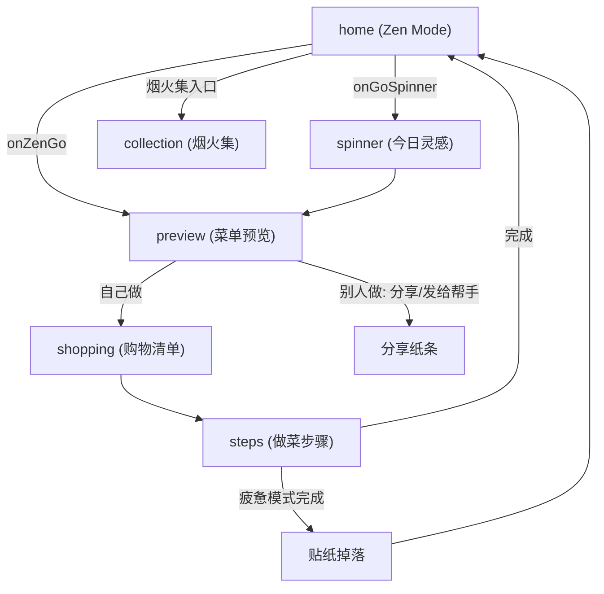

# TableSync 技术规格与 2026 需求实现状态

本文档为 TableSync 微信小程序的核心技术规格与 2026 版需求落地状态说明。需求原文见 [TableSync-核心逻辑与用户体验优化需求-2026.md](./TableSync-核心逻辑与用户体验优化需求-2026.md)。

---

## 1. 核心设计哲学

- **去 AI 感 (Invisible AI)**：不强调 AI 标签，强调「顺手」和「懂我」的直觉体感。
- **界面消失 (Interface ZERO)**：根据用户意图（心情、执行者）直接切换结果形态，消除冗余操作层级。
- **情绪共护**：根据用户疲惫程度提供治愈方案（如空气炸锅极简方案、纸条化交付）。

---

## 2. Zen Mode 状态机矩阵 (Logic Matrix)

算法与前端共同实现：`stressWeight` 通过 `preference.isTimeSave` 表达，`executorRole` 通过 `preference.who`（`caregiver` / `ayi`）表达。

| 维度 | 自己做 (Self) | 别人做 (Others) |
|------|---------------|-----------------|
| **心情还好 (Good)** | 追求成就感：保留精细化步骤，效率提升。**已实现**：常规菜单与步骤。 | 协作模式：清晰烹饪备忘录。**已实现**：preview 展示「给 Ta 的菜单」+ helper-card 纸条。 |
| **我很疲惫 (Tired)** | 极致减负：强制 `is_airfryer_alt`，优先空气炸锅/烤箱。**已实现**：menuGenerator 优先空气炸锅菜谱 + recipes 中 9 道 air_fryer 菜。 | 托付模式：「给 Ta 的小纸条」、操作难度极简。**已实现**：helper-card + formatForHelper 线性化步骤。 |

---

## 3. 页面导航与数据流

### 3.1 页面导航图

### 3.2 状态贯通机制

- **首页（无感角色切换）**：home 仅保留 **cookStatus**（还行 / 疲惫）选择；角色固定为「自己做」（cookWho 恒为 `self`，不再展示「谁来做」开关）。持久化：`wx.setStorageSync('zen_cook_status')`；`_buildZenPreference()` 产出 `preference.isTimeSave`、`preference.kitchenConfig.hasAirFryer`，`preference.who` 不传。
- **分享裂变**：用户点击分享时，`onShareAppMessage` 的 path 强制带 `role=helper`，接收方打开即进入 steps 执行者模式（纸条/阿姨模式），本机 preview 始终为标准视图。
- **preference** 通过 `getApp().globalData.preference` 与 storage 传递到 **preview → shopping → steps**。
- 各页根据 `preference.isTimeSave` 做差异化展示（空气炸锅标签、疲惫氛围等）；steps 根据 URL 参数 `role=helper` 进入执行者模式。

---

## 4. 需求模块实现状态

| 模块 | 状态 | 说明 |
|------|------|------|
| 视觉氛围 (Atmosphere) | 已完成 | home 全屏背景按 mood/executor 切换，0.8s 淡入淡出；preview/shopping 氛围与指标文案差异化。 |
| 空气炸锅强制 (is_airfryer_alt) | 已完成 | menuGenerator 疲惫模式优先空气炸锅池；recipes 新增 9 道 `cook_type: 'air_fryer'` 且 `is_airfryer_alt: true`。 |
| 纸条化交付 (Helper Memo) | 已完成 | components/helper-card 三大区（帮我准备 / 极简动作 / 情绪话术）；menuGenerator.formatForHelper(menus, preference, shoppingList)；preview 在 isHelperMode 下展示 helper-card。 |
| 全链路状态贯通 | 已完成 | preview/shopping/steps 读取 preference 与 Storage，展示 isHelperMode / isTiredMode 差异；steps 在 preference.who === 'caregiver' 时自动 isAyiMode。 |
| 烟火集与贴纸 | 已完成 | stickerCollection.js 数据层与 tryDropSticker；疲惫模式完成烹饪掉落 tired_done；sticker-drop 组件；collection 页与 home 入口。 |
| preview 菜单区去重 | 已完成 | 今日菜单标题区仅保留主标题（今日菜单 / 给 Ta 的菜单），移除副标题 `previewMenuSubtitle` 与节奏芯片 `previewRhythmRings`，菜名仅在下方案品卡片展示，避免重复。 |
| stressWeight 评分因子 | 待扩展 | 当前 isTimeSave 已驱动过滤与空气炸锅优先，未单独暴露 stressWeight 数值。 |

---

## 5. 组件清单

| 组件 | 路径 | 用途 |
|------|------|------|
| helper-card | components/helper-card/helper-card | 「别人做」模式下的纸条化菜单（The Prep / The Action / The Heart）。 |
| sticker-drop | components/sticker-drop/sticker-drop | 贴纸掉落弹层，从 steps 完成回首页时展示。 |

---

## 6. 关键数据与接口

- **formatForHelper(menus, preference, shoppingList)**  
  - 位置：`miniprogram/data/menuGenerator.js`  
  - 返回：`{ prepItems: [{ name, amountDisplay }], actions: [{ text }], heartMessage: string }`

- **stickerCollection.tryDropSticker(stickerId, source)**  
  - 位置：`miniprogram/data/stickerCollection.js`  
  - 掉落 ID：`tired_done`（疲惫模式完成）、`share_memo`（分享纸条，可扩展触发时机）

- **globalData.pendingStickerDrop**  
  - 步骤页完成时若掉落贴纸则写入；home 的 onShow 读取并展示 sticker-drop，关闭后清空。

---

## 7. 参考文档

- 需求汇总：[TableSync-核心逻辑与用户体验优化需求-2026.md](./TableSync-核心逻辑与用户体验优化需求-2026.md)
- 厨房设备与空气炸锅逻辑：[design-kitchen-devices-adaptation.md](./design-kitchen-devices-adaptation.md)

---

## 8. 云端菜谱与步骤/购物清单修复（AI 必读）

> **用途**：后续在其他窗口或会话中修改相关逻辑时，请先阅读本节，避免破坏已修复行为或重复修改。  
> **问题背景**：用户希望从云端查看菜谱的食材与步骤；本地 `recipes.js` 为精简版（无 steps/ingredients），完整数据来自云数据库。若同步时机、分页或缓存策略不当，会出现「步骤/食材缺失」「重新加载无反应」等问题。

### 8.1 数据流与原则

- **步骤与食材来源**：优先从 `cloudRecipeService` 的内存/存储缓存读取；缓存来自 `syncFromCloud()` 拉取的云数据库 `recipes` 集合。本地 `recipes.js` 仅作无网络或云端无数据时的兜底（且无 steps/ingredients）。
- **关键原则**：凡使用「今日菜单」或「混合组餐」等菜单数据生成步骤或购物清单时，**必须按菜谱 id 从当前缓存重新解析**（`getAdultRecipeById` / `getBabyRecipeById`），不能直接使用页面或 globalData 里保存的旧菜谱引用（可能是同步前拿到的残缺对象）。

### 8.2 cloudRecipeService.js 修改要点

| 修改点 | 说明 |
|--------|------|
| 分页拉取 | 小程序端云数据库 `get()` 单次最多返回 **20 条**。使用 `pageSize = 20`，且**每次分页重新** `collection.where(...).skip(skip).limit(20).get()`，不可复用同一 query 对象。 |
| 先更新内存再写存储 | 同步成功后**先**赋值 `_memoryCache.adultRecipes` / `babyRecipes`，**再**调用 `saveToStorage()`。这样即使本地存储因体积超限（如 10MB）写入失败，本次会话仍能使用完整数据。 |
| 安全网条件 | 仅当 **合并后条数为 0**（`mergedAdult.length === 0`）时才用本地 `recipes.js` 做 fallback 合并。若云端有数据（如 20 条），不再按「少于本地 50%」触发安全网，避免用无 steps 的本地数据冲掉云端数据。 |
| 存储失败日志 | `saveToStorage` 内对写入失败做 try/catch，并 `console.warn`，便于排查超限等问题。 |

### 8.3 menuData.js 修改要点

- **generateSteps**：当存在 `todayMenus` 时，先用 `resolveMenu` 对每条菜单按 `adultRecipe.id` / `babyRecipe.id` 调用 `getAdultRecipeById` / `getBabyRecipeById`，得到带 steps/ingredients 的菜谱，再基于 `menusWithFreshRecipes` 调用 `generator.generateSteps` / `generateUnifiedSteps` 和 `generateShoppingListFromMenus`。这样无论菜单是何时生成的，步骤与购物清单都基于**当前缓存**。
- 若某 id 在缓存中找不到带 steps 的菜谱，会打 `console.warn('[menuData.generateSteps] 缓存条数=..., 未找到带步骤的菜谱 id=...')` 便于排查。

### 8.4 步骤页 steps.js / steps.wxml 修改要点

| 修改点 | 说明 |
|--------|------|
| 自动重试 | 当生成的步骤为「需联网获取」提示（一条步骤且 `_isOfflineHint === true` 或 title 为「提示」且 details 含「联网」）时，约 **800ms 后自动调用** `retryLoadStepsFromCloud()`，无需用户点击。 |
| 重新加载按钮 | 按钮使用 `type="plain"`、`catchtap="retryLoadStepsFromCloud"`，不限制 `_source`，任意入口均可触发。若接口返回「同步进行中」，则约 **2.5s 后再试一次**。 |
| retryLoadStepsFromCloud 按来源处理 | **menu**：清空 `app.globalData.todayMenus` 后调用 `menuData.generateSteps`（会从 storage 的 today_menus 重新解析）。**mix**：用 `_mixMenus`（或 globalData.mixMenus）逐条按 id 解析后 `generateUnifiedSteps` / `generateSteps`。**scan**：用 `_scanRecipeIds` 调用 `menuData.generateStepsFromRecipeIds` 再更新步骤与 `_scanMenus`。**ayi**：存 `_ayiAdultCount`，用 `_ayiRecipeIds` 调用 `generateStepsFromRecipeIds`，写回 `todayMenus` 后 `generateSteps(..., { forceLinear: true })`。**import** 仅同步并 toast「已同步，请返回重新进入」。 |
| 展示 | 步骤缺失时展示「重新加载步骤」按钮、加载中文案及同步错误 `stepsSyncError`；`_updateView` 中根据是否离线提示设置 `showOfflineHint`。 |

### 8.5 购物清单页 shopping.js 修改要点

| 修改点 | 说明 |
|--------|------|
| updateList 数据源顺序 | ① 优先用**今日菜单**：`app.globalData.todayMenus` 或从 storage 的 `today_menus` 经 `deserializeMenusFromStorage` 得到；对每条菜单按 id 解析后 `generateShoppingListFromMenus`。② 若无今日菜单或未得到清单，则用 **mix**：若存在 `app.globalData.mixMenus`，同样按 id 解析后 `generateShoppingListFromMenus`。③ 再否则用已有 `cart_ingredients` 或 `menuData.generateShoppingList(pref)`。 |
| 写回 | 由 ① 或 ② 得到非空清单时，写入 `wx.setStorageSync('cart_ingredients', ...)` 并 `app.globalData.mergedShoppingList = ...`。 |
| onShow | `onShow` 中先执行 `this.updateList()`，再按 storage 做 setData，保证从步骤页等返回时用最新缓存刷新清单（含今日菜单与 mix 两路）。 |

### 8.6 步骤页入口与 source

| 入口 | source | 跳转示例 | 重试时数据来源 |
|------|--------|----------|----------------|
| 今日菜单 / 购物清单 | （无） | `/pages/steps/steps` | todayMenus（清空后从 storage 再解析） |
| 混合组餐 | mix | `?source=mix&recipeNames=...` | globalData.mixMenus，按 id 解析 |
| 扫描/冰箱组餐 | scan | `?source=scan&recipeIds=...` | _scanRecipeIds → generateStepsFromRecipeIds |
| 阿姨/分享卡片 | ayi | `?source=ayi&recipeIds=...&adultCount=...` | _ayiRecipeIds + _ayiAdultCount → generateStepsFromRecipeIds + forceLinear |
| 导入菜谱 | import | `?source=import&recipeName=...` | 仅同步 + toast，不按 id 解析（数据来自用户导入） |

### 8.7 涉及文件一览

- `miniprogram/utils/cloudRecipeService.js`：拉取、合并、内存/存储顺序、安全网、saveToStorage 日志。
- `miniprogram/data/menuData.js`：generateSteps 内 todayMenus 的 resolveMenu + menusWithFreshRecipes。
- `miniprogram/pages/steps/steps.js`：onLoad 自动重试、retryLoadStepsFromCloud（menu/mix/scan/ayi）、_ayiAdultCount 存储。
- `miniprogram/pages/steps/steps.wxml`：showOfflineHint、重新加载按钮、stepsReloading、stepsSyncError。
- `miniprogram/pages/steps/steps.wxss`：offline-reload 区域样式。
- `miniprogram/pages/shopping/shopping.js`：updateList 的今日菜单 + mixMenus 按 id 解析，onShow 调用 updateList。
- `miniprogram/pages/preview/preview.js`：helper 模式下 onLoad 后调用 `syncCloudRecipes()`，同步完成后用 `generateStepsFromRecipeIds` + `formatForHelperFromResult` 刷新 helperData，保证纸条步骤来自当前缓存。

### 8.8 分享链路与 preview 纸条的云端步骤

- **分享进入的 helper-card（steps 页）**：入口为 `role=helper&recipeIds=...`，步骤由 `generateStepsFromRecipeIds(ids, pref)` 生成，内部通过 `getAdultRecipeById` 从 cloudRecipeService 缓存取菜谱。若缓存暂无完整步骤（如首次打开、未同步），会展示「需联网获取」；**约 800ms 后自动调用** `retryLoadStepsFromCloud()`（与 menu/mix/scan 一致，不排除 helper 入口），同步后按 ayi 分支重新生成步骤并刷新视图。
- **分享前用户看到的 preview 纸条**：helper 模式下先用当前缓存（含本地或已同步云端）构建 helperData；**onLoad 完成后会再调一次** `syncCloudRecipes()`，同步成功后用 `generateStepsFromRecipeIds` + `formatForHelperFromResult` 重算 helperData 并 setData，从而在云端数据就绪后纸条中的「极简动作」与分享打开后的步骤一致且为完整步骤。
