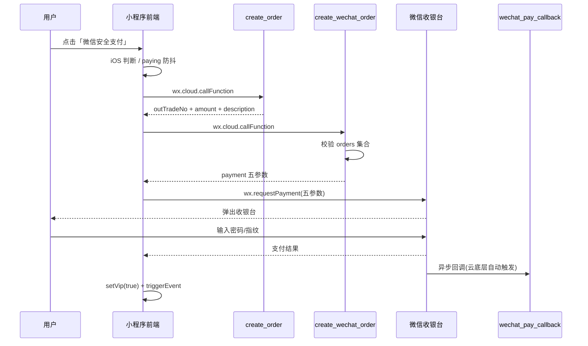
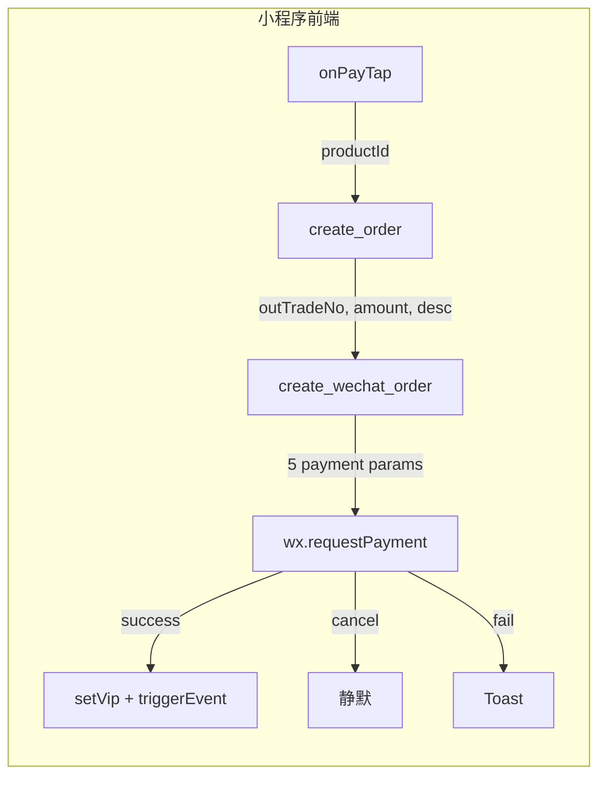

# 前端拉起微信收银台——极简代码链路

## 整体时序



## 入口：谁触发了支付

文件：[miniprogram/pages/steps/steps.js](miniprogram/pages/steps/steps.js) 第 1707 行

```javascript
toggleGanttSheet: function () {
  var app = getApp();
  if (!app.globalData.isVip) {
    this.setData({ showVipPaywall: true });  // 弹出付费抽屉
    return;
  }
  this.setData({ showGanttSheet: !this.data.showGanttSheet });
}
```

用户在 steps 页面点击「统筹」按钮 → 非 VIP 时弹出 `vip-paywall` 组件 → 组件内部按钮触发 `onPayTap`。

## 核心三步调用链（全部在 onPayTap 内）

文件：[miniprogram/components/vip-paywall/vip-paywall.js](miniprogram/components/vip-paywall/vip-paywall.js) 第 36-87 行

### Step 1: 创建订单 → 拿 outTradeNo

```javascript
wx.cloud.callFunction({
  name: 'create_order',
  data: { productId: 'vip_monthly' }
})
```

- 云函数在 `orders` 集合写入一条 `status: 'PENDING'` 记录
- 返回值中取 `result.data.outTradeNo`、`amount`、`description`
- 校验：`result.code !== 0` 或 `!result.data.outTradeNo` → Toast 报错并 `done()` 退出

### Step 2: 统一下单 → 拿 payment 五参数

```javascript
wx.cloud.callFunction({
  name: 'create_wechat_order',
  data: { outTradeNo, amount, description }
})
```

- 云函数按 `outTradeNo + _openid + status:'PENDING'` 查库校验，核对 `totalFee`
- 调用 `cloud.cloudPay.unifiedOrder()` 获得 payment 对象
- 返回值中取 `orderResult.data`（即 payment）
- 校验：`orderResult.code !== 0` 或 `!orderResult.data` → Toast 报错并 `done()` 退出

### Step 3: 拉起收银台

```javascript
wx.requestPayment({
  timeStamp: pay.timeStamp,
  nonceStr:  pay.nonceStr,
  package:   pay.package,       // 形如 "prepay_id=wx..."
  signType:  pay.signType || 'RSA',
  paySign:   pay.paySign
})
```

这 5 个参数由 `cloud.cloudPay.unifiedOrder()` 在服务端自动签好，前端原样透传，**不做任何拼接或二次签名**。

## 支付结果处理

### 成功 (`.then`)

```javascript
getApp().setVip(true);           // globalData + localStorage 双写
self.triggerEvent('unlock');     // 通知 steps 页打开甘特图
self.triggerEvent('close');      // 关闭付费抽屉
wx.showToast({ title: '支付成功', icon: 'success' });
```

### 失败 (`.catch`)

```javascript
// 用户主动取消 → 静默吞掉，不弹 Toast
if (err.errMsg.indexOf('requestPayment:fail cancel') !== -1) return;
// 其他错误 → Toast 提示
wx.showToast({ title: err.errMsg || '支付失败', icon: 'none' });
```

### 收尾 (`.then` finally)

```javascript
done();  // 即 self.setData({ paying: false })，解除按钮防抖
```

## 防抖与平台隔离

- **paying 状态锁**：按钮 `disabled="{{paying}}"` + JS 层 `if (this.data.paying) return`，防止重复点击
- **iOS 隔离**：`attached` 时读取 `app.globalData.platformInfo.platform`，iOS 下 `isIOS = true`，`onPayTap` 首行 `if (this.data.isIOS) return` 直接拒绝，WXML 侧按钮显示「iOS 暂不支持」

## 数据流向总结



前端全程只做三件事：**传参调云函数、透传支付参数给 `wx.requestPayment`、根据结果更新 UI 状态**。所有金额校验、签名、订单状态机都在云端完成。
